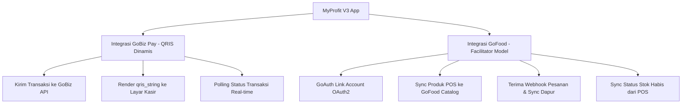

# Analisis Integrasi GoBiz Developer Portal ke Aplikasi MyProfit V3

Dokumen ini menyajikan hasil riset mendalam terhadap dokumentasi resmi **GoBiz Developer Portal** (https://developer.gobiz.com/docs/docs/intro/) serta analisis kecocokan dan strategi integrasinya ke dalam aplikasi kasir (Point of Sale) **MyProfit V3**.

---

## 1. Pendahuluan & Eligibilitas GoBiz
GoBiz Developer Portal menyediakan API terbuka (*Open API*) dari Gojek untuk membantu merchant meningkatkan efisiensi operasional dengan mengintegrasikan sistem internal merchant (seperti POS atau ERP) dengan layanan Gojek (terutama **GoFood** dan **GoPay/QRIS**).

*   **Eligibilitas:** Terbuka untuk seluruh merchant GoBiz aktif di Indonesia dan Vietnam.
*   **Lingkungan Pengujian (Sandbox vs Production):**
    *   **OAuth Base URL:**
        *   Sandbox: `https://integration-goauth.gojekapi.com/`
        *   Production: `https://accounts.go-jek.com/`
    *   **GoBiz Open API Base URL:**
        *   Sandbox: `https://api.partner-sandbox.gobiz.co.id/`
        *   Production: `https://api.gobiz.co.id/`

---

## 2. Kapabilitas Utama API GoBiz

GoBiz menyediakan dua lini produk utama untuk integrasi sistem POS:

### A. Food Integration (GoFood)
Berguna untuk mengotomatisasi pengelolaan outlet, sinkronisasi menu, pengelolaan stok, dan penerimaan pesanan GoFood langsung ke aplikasi kasir.

1.  **Otentikasi & Keamanan (OAuth 2.0):**
    *   **Direct Integration Model:** Menggunakan `grant_type=client_credentials` (Basic Auth dengan App ID & Secret). Cocok jika merchant menggunakan sistem kasir buatan sendiri untuk outlet mereka.
    *   **Facilitator Model (Sangat Cocok untuk POS Penyedia Jasa):** Menggunakan `grant_type=authorization_code` (Flow OAuth2 standar di mana merchant memasukkan nomor telepon GoBiz, OTP, dan memberikan izin akses). POS bertindak sebagai fasilitator yang mengelola banyak merchant.
2.  **Manajemen Katalog / Sinkronisasi Menu:**
    *   **Struktur Data:** Kategori Menu → Item Menu (Nama konsumen, Nama internal, Deskripsi, Harga, Gambar 1:1 max 1MB, Jam Operasional) → Kategori Varian → Pilihan Varian (Nama, Tambahan harga, Status stok).
    *   **Endpoint:**
        *   `GET /integrations/gofood/outlets/{outlet_id}/v2/catalog` (Mendapatkan katalog saat ini).
        *   `PUT /integrations/gofood/outlets/{outlet_id}/v1/catalog` (Memperbarui seluruh katalog. Operasi bersifat *overwrite*).
3.  **Manajemen Stok (Out of Stock - OOS):**
    *   Memungkinkan POS memperbarui ketersediaan menu/varian secara instan tanpa melakukan sinkronisasi ulang seluruh menu.
    *   **Endpoint:**
        *   `PATCH /integrations/gofood/outlets/{outlet_id}/v2/menu_item_stocks` (Update stok menu item).
        *   `PATCH /integrations/gofood/outlets/{outlet_id}/v2/variant_stocks` (Update stok varian).
4.  **Manajemen Pesanan (Order Ingestion via Webhooks):**
    *   Gojek mengirimkan notifikasi ke webhook URL merchant untuk setiap perubahan status pesanan.
    *   **Aliran Event Pesanan:**
        1.  `gofood.order.created` (Pesanan dibuat oleh konsumen).
        2.  `gofood.order.merchant_accepted` (Pesanan diterima secara otomatis atau manual oleh merchant. Ini adalah **operational trigger** untuk mulai menyiapkan makanan).
        3.  `gofood.order.driver_otw_pickup` (Driver menuju outlet).
        4.  `gofood.order.driver_arrived` (Driver sampai di outlet).
        5.  `gofood.order.placed` (PIN ditukarkan oleh driver dengan kasir. Ini adalah **critical trigger untuk settlement pembayaran**).
        6.  `gofood.order.completed` (Pesanan selesai diantar).
        7.  `gofood.order.cancelled` (Pesanan dibatalkan).
        8.  `gofood.order.webhook_error` (Kesalahan parsing webhook, misal karena menu mapping tidak ditemukan).
5.  **Pesanan Terjadwal & Catering:**
    *   **Regular Scheduled Order:** Pesanan dibuat di hari H-1/H-X. Event `created` dikirim seketika saat order, tetapi event `merchant_accepted` baru dikirim ~30 menit sebelum jadwal pengiriman.
    *   **GoFood Catering:** Konsumen memesan beberapa makanan untuk beberapa hari sekaligus. Event `created` untuk menu pertama dikirim langsung, sementara untuk menu hari berikutnya dikirim H-24 sebelum pengiriman.
6.  **Manajemen Toko & Promosi:**
    *   Membuka/menutup outlet melalui API.
    *   Mengatur promo diskon tingkat SKU produk.

### B. Pay Integration (GoBiz Pay / GoPay)
Berguna untuk memproses pembayaran non-tunai berbasis QRIS dinamis langsung dari perangkat kasir merchant tanpa memerlukan mesin EDC fisik tambahan.

1.  **Pembuatan Transaksi (Dynamic QRIS):**
    *   POS mengirimkan detail transaksi (gross_amount, order_id, detail item, nama merchant/pelanggan) ke GoBiz.
    *   **Endpoint:** `POST /integrations/payment/outlets/{outlet_id}/v2/transactions` (Scope: `payment:transaction:write`).
    *   **Response:** Mengembalikan `qris_string` (berisi string QRIS standar EMVCo) dan URL gambar QR code (`generate-qr-code`).
2.  **Pengecekan Status Transaksi:**
    *   POS melakukan polling secara periodik untuk mengetahui apakah konsumen sudah membayar.
    *   **Endpoint:** `GET /integrations/payment/outlets/{outlet_id}/v1/transactions/{transaction_id}` (Scope: `payment:transaction:read`).
    *   **Response:** Mengembalikan status transaksi (`status` = "SETTLEMENT", "PENDING", dll.) dan waktu penyelesaian pembayaran (`settlement_at`).

---

## 3. Analisis Kecocokan & Potensi Integrasi di MyProfit V3

Sebagai aplikasi kasir berbasis mobile (React Native/Expo) yang dinamis, MyProfit V3 memiliki potensi besar untuk mengintegrasikan kapabilitas GoBiz di dua area utama:

### Usulan 1: Integrasi GoBiz Pay (Pembayaran QRIS Dinamis)
Saat ini, MyProfit V3 memiliki modul pembayaran QRIS (`app/payments/qris/index.tsx`) yang membaca response transaksi terakhir dari `AsyncStorage` dan menampilkan QR code dinamis ke layar. 

**Bagaimana GoBiz Pay bisa diintegrasikan:**
*   **Pengganti/Tambahan Gateway:** GoBiz Pay dapat ditambahkan sebagai opsi QRIS Dinamis baru bagi merchant yang memiliki akun GoBiz.
*   **Aliran Aplikasi:**
    1.  Di halaman Pilih Pembayaran (`app/payments/index.tsx`), kasir memilih metode "**GoBiz QRIS**".
    2.  Aplikasi mengirim request ke endpoint backend POS MyProfit, yang kemudian memanggil API GoBiz `POST /v2/transactions` untuk membuat transaksi QRIS dinamis.
    3.  Backend merespons dengan mengembalikan `qris_string`.
    4.  Aplikasi MyProfit V3 merender `qris_string` tersebut langsung di layar kasir menggunakan komponen `<QRCode value={qrString} />` (seperti yang saat ini diimplementasikan di `app/payments/qris/index.tsx`).
    5.  Aplikasi memulai polling secara berkala ke API `GET /v1/transactions/{transaction_id}` (melalui backend) untuk memverifikasi pembayaran.
    6.  Begitu status transaksi berubah menjadi sukses, aplikasi secara otomatis menampilkan layar sukses pembayaran dan memicu pencetakan struk penjualan.

### Usulan 2: Integrasi Layanan GoFood (POS Facilitator Model)
MyProfit V3 bertindak sebagai POS pihak ketiga (Fasilitator) yang mempermudah merchant GoFood mengelola pesanan mereka dalam satu layar POS tunggal.

**Bagaimana Integrasi GoFood bisa diimplementasikan:**
1.  **Portal Otorisasi Akun (Linking Outlet):**
    *   Menambahkan halaman "Integrasi GoFood" pada menu pengaturan MyProfit V3.
    *   Merchant mengeklik "Hubungkan GoFood", yang akan mengarahkan mereka ke webview otorisasi GoAuth (`https://accounts.go-jek.com/oauth2/auth`).
    *   Setelah merchant memasukkan OTP dan menyetujui akses (*Consent*), Gojek mengembalikan *Authorization Code* ke redirect URI server MyProfit.
    *   Server menukar kode tersebut dengan *Access Token* dan *Refresh Token*, lalu memanggil API Link Outlet `PUT /integrations/partner/outlets/{outlet_id}/v1/link/gofood`.
2.  **Sinkronisasi Menu Satu Klik (Catalog Sync):**
    *   Menyediakan tombol "Sinkronisasi ke GoFood" di halaman Manajemen Produk/Kategori (`app/products/` atau `app/categories/`).
    *   Aplikasi POS mengonversi produk lokal menjadi struktur data katalog GoFood dan mengirimkannya melalui API `PUT /v1/catalog`.
    *   Field `external_id` pada item/varian GoFood diisi dengan ID produk lokal POS. Hal ini sangat penting agar saat ada pesanan masuk, sistem POS dapat langsung mengenali produk mana yang dibeli tanpa terjadi galat *missing_menu_mapping*.
3.  **Penerimaan Pesanan GoFood Otomatis (Order Ingestion):**
    *   Server backend MyProfit mendaftarkan webhook URL ke API GoBiz untuk mendengarkan event pesanan.
    *   Ketika pesanan dibuat oleh konsumen, webhook `gofood.order.created` diterima oleh server, lalu diteruskan ke aplikasi tablet kasir MyProfit via WebSocket.
    *   Aplikasi kasir memutar suara notifikasi pesanan masuk ("*Pesanan GoFood Baru*") menggunakan modul `expo-speech` (seperti yang saat ini dipakai di halaman QRIS).
    *   Ketika kasir menekan tombol "Terima", pesanan dikirim ke sistem dapur (`app/receipt/` atau printer dapur) secara otomatis.
    *   Status pesanan di Gojek akan terupdate secara real-time berdasarkan aksi kasir.
4.  **Verifikasi Settlement dengan Event `gofood.order.placed`:**
    *   Dalam laporan keuangan POS, pesanan GoFood sering kali membingungkan apakah sudah diselesaikan pembayarannya atau tidak (karena status `completed` atau `cancelled` tidak mencerminkan transaksi keuangan).
    *   POS dapat menggunakan event `gofood.order.placed` (saat driver menukarkan PIN dengan kasir) sebagai penanda sah bahwa pembayaran pesanan tersebut telah selesai diproses oleh Gojek dan dana akan ditransfer ke merchant.
5.  **Sinkronisasi Stok Habis Otomatis (OOS Real-time):**
    *   Ketika kasir mengubah status produk menjadi kosong (out of stock) di aplikasi POS, aplikasi secara otomatis memanggil API `PATCH /v2/menu_item_stocks` or `PATCH /v2/variant_stocks`.
    *   Menu di aplikasi GoFood konsumen langsung berubah menjadi abu-abu (tidak dapat dipesan), sehingga mencegah pembatalan pesanan akibat bahan makanan habis yang dapat menurunkan performa merchant.

---

## 4. Rencana Implementasi Teknis & Rekomendasi Arsitektur

Mengikuti aturan pengembangan di `AGENTS.md` (React Native Senior Developer Guidelines):

1.  **Pemisahan Logika Bisnis:**
    *   Seluruh logika panggilan API GoBiz (request token, post transaction, check status, sync menu) diletakkan di dalam modul utility baru di `utils/gobizApi.ts` atau custom hook `hooks/useGobizPayment.ts`.
    *   Komponen UI hanya menampilkan status rendering (loading, QR code, success/fail screen) dan tidak melakukan fetch HTTP langsung.
2.  **State Management (Zustand & Context):**
    *   Gunakan React Context (`contexts/GobizContext.tsx`) untuk menyimpan token otorisasi merchant, ID outlet, dan status koneksi integrasi (karena jarang berubah).
    *   Gunakan Zustand Store (`stores/gobizOrderStore.ts`) untuk mengelola antrean pesanan GoFood aktif yang masuk ke kasir (karena pesanan sangat dinamis dan sering diupdate).
3.  **Penanganan Luring (Offline-First):**
    *   Karena kasir sering mengalami gangguan koneksi internet, jika status update stok gagal dikirim ke GoBiz, simpan request tersebut ke dalam antrean offline (`offlineTransactionQueue`) di `AsyncStorage` dan coba kirim ulang (*retry*) secara otomatis begitu koneksi internet terdeteksi pulih.
4.  **Autoplay Notifikasi Suara (Speech API):**
    *   Gunakan library `expo-speech` yang sudah ada di proyek untuk membacakan detail pesanan baru secara lisan (misalnya, *"Pesanan baru dari GoFood, nomor antrean F-dua belas"*), membantu kasir tetap sigap meskipun layar tablet sedang menampilkan menu lain.

---

## 5. Kesimpulan & Langkah Selanjutnya

Integrasi GoBiz Developer Portal menawarkan nilai tambah yang sangat tinggi bagi pengguna aplikasi POS MyProfit V3:
1.  **GoBiz Pay** memberikan alternatif QRIS dinamis yang murah dan terintegrasi langsung dengan ekosistem Gojek.
2.  **GoFood Integration** memposisikan MyProfit V3 sebagai POS modern yang mampu mengelola pesanan multi-channel (online & offline) secara otomatis, mengurangi kesalahan manusia (*human error*), dan meningkatkan produktivitas outlet kuliner merchant.

**Rekomendasi Langkah Berikutnya:**
*   Ajukan pendaftaran sebagai **GoBiz Partner** (Facilitator Model) melalui formulir resmi untuk mendapatkan akses Sandbox Client ID & Secret.
*   Buat prototype integrasi pembayaran QRIS dinamis terlebih dahulu karena alur kodenya lebih sederhana dibanding sinkronisasi pesanan GoFood lengkap yang membutuhkan infrastruktur server webhook.
