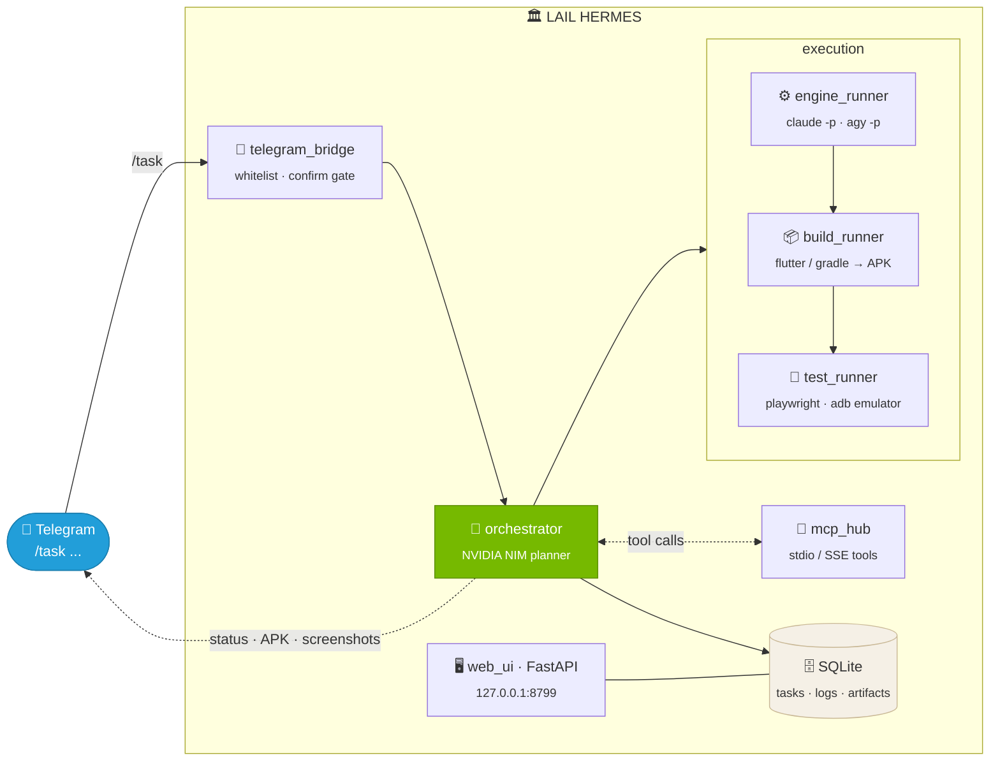

# Hermes Agent

A Windows-local, **Telegram-driven** orchestrator for coding and testing tasks. You send a task
in a Telegram chat; Hermes plans it with a NVIDIA NIM model, delegates the actual coding to the
CLI agents you already have (**Claude Code** and **Antigravity**), builds Android APKs, tests the
result in a headless browser or an Android emulator, and reports back — all configured from a local
web UI.

Hermes is an **orchestrator, not a coder**. Its own brain (a NVIDIA NIM / OpenAI-compatible model)
plans and drives; `claude -p` and `agy -p` do the code writing.

## How it works

<table>
  <tr>
    <td width="25%" align="center">
      <h3>1️⃣ Send</h3>
      <b>Telegram</b><br/><br/>
      <code>/task buat app counter Flutter</code><br/><br/>
      <sub>Numeric user-ID whitelist; risky tasks (git push / delete / outside paths) ask for ✅/❌ confirmation first</sub>
    </td>
    <td width="25%" align="center">
      <h3>2️⃣ Plan</h3>
      <b>NVIDIA NIM brain</b><br/><br/>
      <code>{"steps":[code, build, test]}</code><br/><br/>
      <sub>An OpenAI-compatible NIM model plans the steps and picks an engine; MCP tools available as function calls</sub>
    </td>
    <td width="25%" align="center">
      <h3>3️⃣ Execute</h3>
      <b>Engines &amp; runners</b><br/><br/>
      <code>claude -p</code> · <code>agy -p</code><br/><br/>
      <sub>Coding in an isolated per-task dir, APK build (Flutter/RN/Gradle), test via Playwright or adb + emulator</sub>
    </td>
    <td width="25%" align="center">
      <h3>4️⃣ Report</h3>
      <b>Back to your chat</b><br/><br/>
      <code>step 0 [code]: done ✔</code><br/><br/>
      <sub>Live progress per step; APK + screenshots land in the dashboard and SQLite store</sub>
    </td>
  </tr>
</table>



## Features

- **Telegram control** with a strict numeric user-ID whitelist (non-listed senders are rejected).
- **Two coding engines** driven headlessly: Claude Code (`claude -p`) and Antigravity (`agy -p`),
  auto-selected or overridden per task.
- **APK builds** with automatic project-type detection (Flutter / React Native / native Android).
- **Testing** in a headless browser (Playwright) or an Android emulator (adb), returning screenshots.
- **Local web UI** (`127.0.0.1:8799`) for settings, secrets (masked), an MCP-server manager, and a
  live task dashboard.
- **MCP bridge** exposing MCP tools to the NIM brain as OpenAI function calls (stdio + HTTP/SSE
  transports, lazily connected, every remote call time-bounded).
- **Confirmation gate** — tasks that `git push`, delete files, or touch paths outside the project
  dir wait for an inline-keyboard ✅/❌ in Telegram before running.
- **SQLite session store** — tasks, steps, logs, and artifacts persist and survive restarts.
- **Self-healing launcher** — `start.bat` auto-restarts Hermes 5s after any crash/exit.

## Layout

The app runs from this repo checkout; runtime data lives under `HERMES_HOME`
(default `C:\Hermes`, override via the `HERMES_HOME` env var):

```
C:\Hermes\               # HERMES_HOME (data root)
├─ config\               # config.yaml, .env (secrets), mcp.json
├─ projects\             # per-task workspaces
├─ artifacts\            # apk, screenshots, logs
└─ start.bat             # stub → calls deploy\start.bat in the repo

<repo>\                  # app dir (this checkout)
├─ hermes\               # package
├─ tests\
└─ deploy\               # install.ps1 + start.bat (banner + auto-restart)
```

## Install

Prerequisites on PATH: `python` 3.11+, `claude` (Claude Code CLI), `agy` (Antigravity CLI),
`adb`/`emulator` (Android SDK). For browser testing, the optional `[browser]` extra installs
Playwright.

```powershell
powershell -ExecutionPolicy Bypass -File <repo>\deploy\install.ps1
C:\Hermes\start.bat
```

Then open <http://127.0.0.1:8799> and fill in: NVIDIA API key (build.nvidia.com), model, Telegram bot
token, your allowed Telegram user ID, Android SDK path, and emulator AVD.

## Develop / test

```bash
python -m venv .venv
.venv\Scripts\python -m pip install -e ".[dev]"
.venv\Scripts\python -m pytest -q          # 68 passing
```

Tests are hermetic — no real network, NIM, emulator, or `claude`/`agy` binaries. Engines, build,
test, MCP transport, and the NIM planner are all injected as fakes.

## Known follow-ups

- **HTML forms** for the settings / MCP pages (currently JSON API + minimal dashboard).
- **Resume-after-crash** — task state persists, but interrupted tasks are not re-driven on restart.
- **Targeting an existing project by name** — each task currently gets a fresh
  `projects\<task-id>` workspace.

See [`docs/TODO.md`](docs/TODO.md) for the full backlog history.

## Docs

- [`docs/design-spec.md`](docs/design-spec.md) — architecture and decisions
- [`docs/implementation-plan.md`](docs/implementation-plan.md) — task-by-task build plan
- [`docs/SMOKE.md`](docs/SMOKE.md) — smoke-test checklist

## Security notes

- Secrets live in `config/.env`, are masked in the UI, and are never sent to Telegram or logs.
- The web UI binds `127.0.0.1` only.
- Coding engines run inside an isolated per-task project directory.
