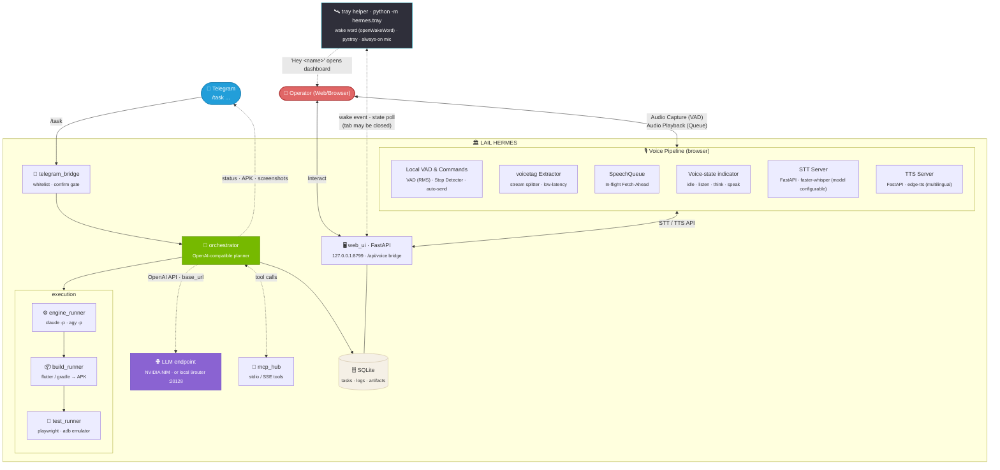

# Hermes Agent

A Windows-local, **Telegram-driven** orchestrator for coding and testing tasks. You send a task
in a Telegram chat; Hermes plans it with a NVIDIA NIM model, delegates the actual coding to the
CLI agents you already have (**Claude Code** and **Antigravity**), builds Android APKs, tests the
result in a headless browser or an Android emulator, and reports back — all configured from a local
web UI.

Hermes is an **orchestrator, not a coder**. Its own brain (a NVIDIA NIM / OpenAI-compatible model)
plans and drives; `claude -p` and `agy -p` do the code writing.

## How it works

<table>
  <tr>
    <td width="25%" align="center">
      <h3>1️⃣ Send</h3>
      <b>Telegram</b><br/><br/>
      <code>/task buat app counter Flutter</code><br/><br/>
      <sub>Numeric user-ID whitelist; risky tasks (git push / delete / outside paths) ask for ✅/❌ confirmation first</sub>
    </td>
    <td width="25%" align="center">
      <h3>2️⃣ Plan</h3>
      <b>NVIDIA NIM brain</b><br/><br/>
      <code>{"steps":[code, build, test]}</code><br/><br/>
      <sub>An OpenAI-compatible NIM model plans the steps and picks an engine; MCP tools available as function calls</sub>
    </td>
    <td width="25%" align="center">
      <h3>3️⃣ Execute</h3>
      <b>Engines &amp; runners</b><br/><br/>
      <code>claude -p</code> · <code>agy -p</code><br/><br/>
      <sub>Coding in an isolated per-task dir, APK build (Flutter/RN/Gradle), test via Playwright or adb + emulator</sub>
    </td>
    <td width="25%" align="center">
      <h3>4️⃣ Report</h3>
      <b>Back to your chat</b><br/><br/>
      <code>step 0 [code]: done ✔</code><br/><br/>
      <sub>Live progress per step; APK + screenshots land in the dashboard and SQLite store</sub>
    </td>
  </tr>
</table>


```mermaid
flowchart TD
    TG(["📱 Telegram<br/>/task ..."])
    OP(["👤 Operator (Web/Browser)"])
    GW["🌐 LLM endpoint<br/><sub>NVIDIA NIM · or local 9router :20128</sub>"]

    subgraph HERMES["🏛️ LAIL HERMES"]
        direction TB
        BR["🔐 telegram_bridge<br/><sub>whitelist · confirm gate</sub>"]
        OR["🧠 orchestrator<br/><sub>OpenAI-compatible planner</sub>"]
        HUB["🔌 mcp_hub<br/><sub>stdio / SSE tools</sub>"]

        subgraph EXEC["execution"]
            direction TB
            ENG["⚙️ engine_runner<br/><sub>claude -p · agy -p</sub>"]
            BLD["📦 build_runner<br/><sub>flutter / gradle → APK</sub>"]
            TST["🧪 test_runner<br/><sub>playwright · adb emulator</sub>"]
            ENG --> BLD --> TST
        end

        subgraph VOICE_SYS["🎙️ Voice Pipeline (browser)"]
            direction TB
            VAD["Local VAD & Commands<br/><sub>VAD (RMS) · Stop Detector · auto-send</sub>"]
            EXT["voicetag Extractor<br/><sub>stream splitter · low-latency</sub>"]
            Q["SpeechQueue<br/><sub>In-flight Fetch-Ahead</sub>"]
            IND["Voice-state indicator<br/><sub>idle · listen · think · speak</sub>"]
            STT_SRV["STT Server<br/><sub>FastAPI · faster-whisper (model configurable)</sub>"]
            TTS_SRV["TTS Server<br/><sub>FastAPI · edge-tts (multilingual)</sub>"]
        end

        UI["🖥️ web_ui · FastAPI<br/><sub>127.0.0.1:8799 · /api/voice bridge</sub>"]
        DB[("🗄️ SQLite<br/><sub>tasks · logs · artifacts</sub>")]

        BR --> OR
        OR <-.->|"tool calls"| HUB
        OR -.->|"OpenAI API · base_url"| GW
        OR --> EXEC
        OR --> DB
        UI --- DB
    end

    TRAY["🛰️ tray helper · python -m hermes.tray<br/><sub>wake word (openWakeWord) · pystray · always-on mic</sub>"]

    TG -->|"/task"| BR
    OR -.->|"status · APK · screenshots"| TG

    OP <-->|"Audio Capture (VAD)<br/>Audio Playback (Queue)"| VOICE_SYS
    VOICE_SYS <-->|"STT / TTS API"| UI
    OP <-->|"Interact"| UI
    TRAY <-.->|"wake event · state poll<br/>(tab may be closed)"| UI
    TRAY -.->|"'Hey &lt;name&gt;' opens dashboard"| OP

    classDef ext fill:#229ED9,stroke:#1a7fb0,color:#fff
    classDef brain fill:#76B900,stroke:#5a8c00,color:#fff
    classDef store fill:#f5f0e6,stroke:#c9b896,color:#333
    classDef op fill:#e06666,stroke:#a61c1c,color:#fff
    classDef gw fill:#8a63d2,stroke:#5f3dc4,color:#fff
    classDef tray fill:#2f2f3a,stroke:#12b5cb,color:#fff
    class TG ext
    class OR brain
    class DB store
    class OP op
    class GW gw
    class TRAY tray
```

## Features

- **Telegram control** with a strict numeric user-ID whitelist (non-listed senders are rejected).
  `/help` shows the full command guide, `/projects` lists the registered `@name`s, and the
  commands are published to Telegram's `/` autocomplete menu.
- **Two coding engines** driven headlessly: Claude Code (`claude -p`) and Antigravity (`agy -p`),
  auto-selected or overridden per task. Model and effort are configurable per engine from the
  web UI (`--model` for both, `--effort` for claude only — `agy` has no such flag).
- **Engine completion contract** — every code step asks the engine to print a completion
  sentinel after verifying its own work; a session that errors or exits without it gets up to
  two fix-up sessions, and the full transcript is saved as a task artifact.
- **Structured engine output** — `claude` runs with `--output-format json`, so Hermes reads the
  model's own closing message, the session id, the cost and any API error rather than scraping
  stdout. Fix-up rounds `--resume` that session instead of re-sending the task and the previous
  output. `agy` has no such flag, so it stays on text and fresh sessions — the same fallback
  path taken whenever an envelope cannot be parsed.
- **Planner project context** — before planning, the planner is told what it is planning
  against: an existing registered project and its detected type, or a fresh empty workspace.
  For a project with no Android markers it is told outright not to emit a `build` step or an
  emulator test — the conclusion is drawn in Python rather than left to the model.
- **APK builds** with automatic project-type detection (Flutter / React Native / native Android).
- **Testing** in a headless browser (Playwright) or an Android emulator (adb), returning screenshots.
- **Local web UI** (`127.0.0.1:8799`) for settings (engine model/effort dropdowns backed by
  live `agy models` output where reachable), secrets (masked), an MCP-server manager, a
  Projects Registry panel (add/edit/delete with an OK/Missing badge per path), and a live task
  dashboard.
- **Voice input & conversation (VAD + STT + TTS)** — Speak naturally with the assistant using a local Voice Activity Detection (VAD) loop and edge-tts feedback:
  - **Siklus Suara (VAD)**: RMS-based VAD detects speech-start and speech-end locally, dynamically adapting to the room's noise floor. Ducking raises the threshold when the assistant is speaking to prevent self-interruption.
  - **Auto-send everywhere**: A finished transcript submits itself in every mode — push-to-talk and hands-free alike; if a reply is still streaming, the text is parked in the input rather than dropped. Hold `Ctrl+Space` for push-to-talk, or toggle hands-free to submit on silence.
  - **Configurable STT model (latency vs accuracy)**: the Whisper model size is a setting (`tiny`/`base`/`small`/`medium`) — `base` by default, the biggest lever on how long after you stop talking the assistant can start replying. A `hotwords` bias keeps proper nouns like "Jarvis" accurate even at `base`.
  - **Multilingual TTS**: `*MultilingualNeural` edge-tts voices (Andrew/Ava/Brian/Emma, the default) pronounce mixed Bahasa + English natively per phrase; single-locale `id-ID` voices remain for pure-Bahasa output.
  - **Low Latency Smart path**: When Smart TTS mode is on, the model opens its stream with `<voice>One spoken sentence</voice>`. The client extracts this tag mid-stream and synthesises it immediately while the rest of the reply continues streaming.
  - **Per-sentence Verbatim path**: Streams verbatim sentence-by-sentence as the text arrives, utilizing a local sentence splitter.
  - **Ordered Speech Queue**: Plays audio chunks sequentially using `SpeechQueue` with an in-flight fetch-ahead capacity (up to 3 concurrent requests) to hide network latency.
  - **Local Interruption Commands**: Saying "diam" or "stop" locally halts the speech queue immediately without waiting for the LLM response.
  - **Voice-state indicator**: a header pill shows the assistant's state at a glance — idle / listen / think / speak — mirrored by the tray icon's colour.
  - **Direct AEC Check**: Warns the operator if the browser's echo cancellation is missing so they can use a headset to prevent self-interruption.
  - **Prerequisites**: `pip install -e .[voice]`. Audio transcription runs locally via faster-whisper (int8, CPU).
- **Wake word & Windows tray (`python -m hermes.tray`)** — an optional native helper keeps the microphone alive with the browser closed. It runs a local wake word via openWakeWord and shows a system-tray icon whose colour tracks the voice state. The spoken phrase follows the agent's name: `"auto"` turns **Jarvis** into the bundled `hey_jarvis`; any other name (e.g. **Ev**) needs a trained `hey_<name>.onnx` in `%HERMES_HOME%\wakewords`. On wake it starts a hands-free capture, opening the dashboard first if no tab is open. `pip install -e .[desktop]` (openwakeword, sounddevice, pystray, Pillow); launch alongside Hermes via `deploy\tray.bat`.
- **Pluggable LLM endpoint** — the planner/chat/voice-summary calls go to any OpenAI-compatible `base_url`. Point it at a local **9Router** gateway (`http://127.0.0.1:20128/v1`, launched from `start.bat`) to route through its token and 100+ models, or at NVIDIA NIM / DeepSeek directly. The coding engines (`claude`/`agy` CLIs) are separate and unaffected.
- **MCP bridge** exposing MCP tools to both the planner and the web-chat/voice agent as OpenAI
  function calls (stdio + HTTP/SSE, lazily connected, every remote call time-bounded). Add
  file / browser / Gmail / calendar servers to control them by command — in chat, reads run
  immediately while writes/sends are gated for confirmation (`hermes/mcp_risk.py`). See
  [`docs/INTEGRATIONS.md`](docs/INTEGRATIONS.md).
- **Existing projects** — register a name-to-path map in settings, then aim a task at it with
  `/task @myprofit fix login`. Without `@`, a fresh workspace is created as before.
- **Confirmation gate** — tasks that `git push`, delete files, touch paths outside the project
  dir, or target a registered project with no usable git undo (dirty tree, not a repo,
  git-ignored, or git unavailable) wait for an inline-keyboard ✅/❌ in Telegram before running.
- **Risky-but-ungated disclosure** — with `confirm_risky` off, risky tasks still run, but the
  queued message says exactly what the gate saw instead of proceeding silently.
- **SQLite session store** — tasks, steps, logs, and artifacts persist and survive restarts.
- **Startup recovery** — on start, tasks stranded in `running`/`queued`/`awaiting_confirm` are
  retired to `interrupted` and each affected chat gets one digest telling them what died and
  what to resubmit.
- **Self-healing launcher** — `start.bat` auto-restarts Hermes 5s after any crash/exit, and launches the local 9Router gateway (port 20128) once in the background if it is installed.

## Working on an existing project

Register the project once in the **Projects Registry panel** on the settings tab at
http://127.0.0.1:8799 — a name plus an absolute folder path per project (cards show an
OK/Missing badge; the folder itself is never touched). Then aim a task at it with the
`@name` sigil:

```
/task @myprofit fix the login bug
```

Without `@`, Hermes creates a fresh workspace under `projects_path` as before.
`@name` is deliberately the *only* trigger — a bare "project myprofit" in prose
starts a new workspace, so that a folder named `app` or `test` can never be
matched out of ordinary task text.

An unregistered `@name` is rejected with the list of registered names; it does
not silently fall back to a new workspace. When no projects are registered at
all, the rejection instead says so and points at the settings UI. If the name
*is* registered but its directory has since been moved or deleted, Hermes
rejects the task with a different message pointing at the settings UI, instead
of the name list.

If the target has no usable git undo — uncommitted changes, not a git repo, git-ignored by
an enclosing repo, or git itself unavailable (missing binary, no subprocess support, or a
timeout) — Hermes asks for confirmation first (`confirm_risky` is on by default). With the
gate off, the task runs anyway but the queued message carries a warning listing what the
gate saw — never silently.

## Layout

Two locations, and they are independent. The app runs from this repo checkout
(`<repo>` below — wherever you cloned it). Runtime data lives under a separate
data root named by the `HERMES_HOME` environment variable (`%HERMES_HOME%`
below). Neither has a required location; put them wherever suits the machine.

```
%HERMES_HOME%\           # data root — you choose where
├─ config\               # config.yaml, .env (secrets), mcp.json
├─ projects\             # per-task workspaces
├─ artifacts\            # apk, screenshots, logs
├─ wakewords\            # custom wake-word models (hey_<name>.onnx)
├─ hermes.db             # task history
└─ start.bat             # stub → sets HERMES_HOME, calls deploy\start.bat in the repo

<repo>\                  # app dir (this checkout) — you choose where
├─ hermes\               # package
├─ tests\
└─ deploy\               # install.ps1 · start.bat (banner + auto-restart + 9router) · tray.bat
```

## Install

Prerequisites on PATH:
- `python` 3.11+
- `node` 20+ & `npm` (required to install & build the React Web UI)
- `claude` (Claude Code CLI)
- `agy` (Antigravity CLI)
- `adb`/`emulator` (Android SDK)

Optional extras: `[browser]` (Playwright, for browser testing), `[voice]` (faster-whisper, for
voice input), `[desktop]` (openwakeword · sounddevice · pystray · Pillow, for the wake-word tray
helper). To route LLM calls through a local gateway, install **9Router** (`npm i -g 9router`);
`start.bat` launches it automatically, then point `base_url` at `http://127.0.0.1:20128/v1`.

**Set `HERMES_HOME` first, explicitly.** The installer honours it and stores it for your user;
left unset, different entry points disagree about where the data root is (see below).

```powershell
[Environment]::SetEnvironmentVariable("HERMES_HOME", "D:\Hermes", "User")   # your choice
$env:HERMES_HOME = "D:\Hermes"                                             # this session too
powershell -ExecutionPolicy Bypass -File <repo>\deploy\install.ps1
& "$env:HERMES_HOME\start.bat"
```

### If you do not set it

The fallbacks were written for one particular machine and do not agree with each other:
`deploy\install.ps1` and `deploy\start.bat` fall back to `C:\Hermes`, while `hermes\paths.py`
falls back to `E:\Hermes`. Launching through `start.bat` and launching with
`python -m hermes.main` then read **different** config files, different registries, and
different task databases — with no error, because both roots are valid.

Setting `HERMES_HOME` explicitly removes the question entirely. Reconciling those defaults is
tracked in [`docs/TODO.md`](docs/TODO.md).

Then open <http://127.0.0.1:8799> and fill in: NVIDIA API key (build.nvidia.com), model, Telegram bot
token, your allowed Telegram user ID, Android SDK path, and emulator AVD.

## Planner evals

The unit suite proves the planner is *called* correctly. It cannot prove the planner *plans*
correctly — that is model behaviour, and it changes whenever the model, the temperature or the
system prompt changes.

```powershell
python -m hermes.evals                 # every case once
python -m hermes.evals --list          # case ids, no model calls
python -m hermes.evals --repeat 5      # how steady is a case?
python -m hermes.evals --only web-fix-detail-page
python -m hermes.evals --no-context    # ablation, see below
```

### Can the set fail?

A scorecard that reads 100% is worthless until you know it *can* read less. `--no-context`
plans every case with no project context, the way the planner worked before it was given one.
Cases whose task text pulls toward an APK on a project that has none are expected to fail
there. If a full run and an ablation run score the same, the set is not measuring the context
and needs a harder case, not a victory lap.

Baseline, measured 2026-07-21 on `deepseek-ai/deepseek-v4-flash` at temperature 0:

| Run | Result |
|-----|--------|
| `python -m hermes.evals` | **10/10** |
| `python -m hermes.evals --no-context` | **8/10** — `web-build-wording` and `web-apk-wording` fail |

Those two cases are the whole reason the set means anything. Without context they plan
`['code','build']` and `['code','build','test']` against a project with no Android markers,
the second reproducing the live failure of task `20260715-104754-5b44a5` exactly. The other
eight score identically with and without context, so on their own they could not tell a
planner that reads the project from one that guesses.

The first version of this golden set had only those eight, scored 8/8, and was worth nothing.

It drives the real `build_nim_planner` and the real context assembly — a local copy of either
would score itself instead of what production runs. It needs your NVIDIA key, and each case
costs one planner call.

Scoring is restricted to rules the system prompt already mandates: no `build` or emulator test
for a project that cannot produce an APK, no emulator test without a build before it, known
step types, and one code step for a fix task. Nothing scores taste — engine choice and prompt
wording vary between correct answers, so scoring them would measure noise.

Results are `PASS` / `FAIL` / **`ERROR`**. A model outage is an `ERROR` and never counts as a
quality regression. Exit codes: 0 clean, 1 a rule was violated, 2 nothing could be measured.

Deliberately not part of `pytest`: the result is a measurement, not a verdict, and a stochastic
signal wired into the suite either goes flaky or teaches everyone to ignore red. The scoring
rules themselves are pure functions and *are* unit-tested, in `tests/test_eval_rules.py`.

`Settings.planner_temperature` defaults to `0.0`. Planning emits JSON that must obey fixed
rules, so sampling randomness buys nothing and makes the same task plan differently run to run.

## Develop / test

```bash
python -m venv .venv
.venv\Scripts\python -m pip install -e ".[dev]"
.venv\Scripts\python -m pytest -q
```

Tests are hermetic — no real network, NIM, emulator, or `claude`/`agy` binaries. Engines, build,
test, MCP transport, and the NIM planner are all injected as fakes.

## Known follow-ups

- **Resume-after-crash** — the startup sweep retires interrupted tasks and notifies the chat,
  but nothing re-drives them yet; resubmitting is manual.
- **Stale confirm buttons** — after a restart, taps on old ✅/❌ buttons do nothing (pending
  confirmations are in-memory); the restart digest tells the user to resubmit.
- **End-to-end smoke run** — whether a live `claude` honours the completion contract, and
  whether `--resume` restores a session's context, are both still unproven against fakes only;
  see [`docs/SMOKE.md`](docs/SMOKE.md).

See [`docs/TODO.md`](docs/TODO.md) for the full backlog history.

## Docs

- [`docs/design-spec.md`](docs/design-spec.md) — architecture and decisions
- [`docs/INTEGRATIONS.md`](docs/INTEGRATIONS.md) — connect file / browser / Gmail / calendar via MCP
- [`docs/SMOKE.md`](docs/SMOKE.md) — smoke-test checklist
- [`docs/superpowers/specs/`](docs/superpowers/specs/) — feature design specs
  (project registry, startup recovery)

## Security notes

- Secrets live in `config/.env`, are masked in the UI, and are never sent to Telegram or logs.
- The web UI binds `127.0.0.1` only.
- Coding engines run inside an isolated per-task project directory.
