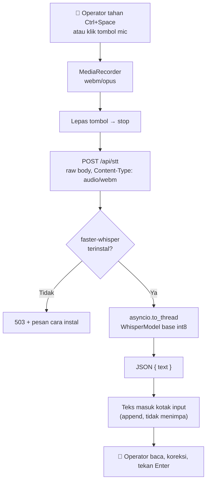

# 🎤 Implementation Plan: Voice Input (STT) — P1 Jarvis

> **For agentic workers:** REQUIRED SUB-SKILL: Use superpowers:subagent-driven-development (recommended) or superpowers:executing-plans to implement this plan task-by-task. Steps use checkbox (`- [ ]`) syntax for tracking.

**Goal:** Memberi Hermes indra pendengaran — operator menekan mic, bicara, dan ucapannya jadi teks di kotak input chat.

**Architecture:** Browser merekam lewat `MediaRecorder` (webm/opus), mengirim blob mentah sebagai request body ke `POST /api/stt`. Server mentranskrip dengan faster-whisper `base` int8 di CPU lewat `asyncio.to_thread` supaya event loop tidak terblokir, lalu mengembalikan JSON `{"text": ...}`. Teks masuk ke kotak input untuk direview operator, **tidak** langsung dikirim.

**Tech Stack:** faster-whisper 1.2 (ctranslate2 + av, CPU int8), FastAPI raw-body upload, MediaRecorder API, React 18, esbuild, pytest, node:test.

## Global Constraints

- Python `>=3.11`; environment terverifikasi di 3.14.3. `faster-whisper 1.2.1` + `ctranslate2 4.8.1` punya wheel di sini.
- **Tidak butuh ffmpeg.** `av 18` ikut terinstal bersama faster-whisper dan mendekode webm/opus langsung dari memori.
- **Tidak ada GPU.** Selalu `device="cpu"`, `compute_type="int8"`. 12 core tersedia.
- **Tidak boleh menambah dependency wajib.** faster-whisper masuk `[project.optional-dependencies]` sebagai extra `voice`, mengikuti preseden `browser = ["playwright>=1.45"]`. Instalasi dasar Hermes harus tetap ringan.
- **Tidak boleh pakai `python-multipart`.** Audio dikirim sebagai raw request body, bukan multipart form — menghindari dependency baru.
- Model whisper: **`base`** (keputusan operator). Ukuran ditulis sebagai satu konstanta supaya naik ke `small` cukup satu baris kalau akurasi Bahasa Indonesia mengecewakan.
- Bahasa default transkripsi: `"id"`. Whisper sering menebak Melayu/Inggris pada klip Indonesia pendek kalau dibiarkan auto-detect.
- Transkrip **selalu** masuk kotak input untuk direview. Tidak ada auto-send di P1. Hermes bisa `git push` dan menghapus file; confirmation gate hanya menangkap aksi berisiko, bukan salah dengar.
- Semua string yang dilihat operator berbahasa Indonesia, mengikuti UI yang sudah ada.
- Semua komentar kode, pesan commit, dan nama simbol berbahasa Inggris, mengikuti codebase yang sudah ada.

---

## 📐 Alur



Kenapa `asyncio.to_thread`: transkripsi adalah kerja CPU sinkron selama ratusan milidetik sampai beberapa detik. Dijalankan langsung di endpoint async, ia membekukan seluruh event loop — termasuk SSE `/api/tasks/events` yang menyuapi dashboard dan stream chat yang sedang jalan.

---

## 🗂️ Struktur File

| File | Aksi | Tanggung jawab |
|---|---|---|
| `hermes/stt.py` | **Create** | Muat model (lazy, sekali, thread-safe) dan transkripsi bytes → teks. Tidak tahu apa-apa soal HTTP. |
| `hermes/config.py` | Modify | Dua field `Settings` baru + validator bahasa |
| `hermes/web_ui.py` | Modify | `POST /api/stt`, `GET /api/stt/status` |
| `pyproject.toml` | Modify | Extra `voice = ["faster-whisper>=1.2"]` |
| `web/src/stt.ts` | **Create** | `VoiceRecorder` + `transcribeBlob` + pemetaan error. Sejajar dengan `web/src/tts.ts`. |
| `web/src/stt.test.ts` | **Create** | Test untuk bagian murni (`sttErrorMessage`, penjaga ukuran, `transcribeBlob` dengan fetch palsu) |
| `web/src/pages/Dashboard.tsx` | Modify | Tombol mic + shortcut Ctrl+Space, isi `inputText` |
| `web/src/pages/ConfigVoice.tsx` | Modify | Bagian "Voice Input (STT)" |
| `tests/test_stt.py` | **Create** | Test unit `hermes/stt.py` dengan model palsu |
| `tests/test_web_ui.py` | Modify | Test endpoint |
| `README.md` | Modify | Baris fitur + catatan instal extra |
| `docs/SMOKE.md` | Modify | Langkah verifikasi manual |

`hermes/stt.py` sengaja dipisah dari `web_ui.py`: file itu sudah 904 baris dan menaruh pemuatan model di sana membuatnya tidak bisa diuji tanpa menjalankan FastAPI.

---

### Task 1: Modul STT engine

**Files:**
- Create: `hermes/stt.py`
- Modify: `pyproject.toml:14-16`
- Test: `tests/test_stt.py`

**Interfaces:**
- Consumes: tidak ada (task pertama)
- Produces:
  - `hermes.stt.MODEL_SIZE: str` = `"base"`
  - `hermes.stt.MAX_AUDIO_BYTES: int` = `26214400`
  - `hermes.stt.SttUnavailable(RuntimeError)`
  - `hermes.stt.available() -> bool`
  - `hermes.stt.is_loaded() -> bool`
  - `hermes.stt.transcribe(audio: bytes, language: str = "id") -> str`
  - `hermes.stt._reset_model_for_tests() -> None`

- [ ] **Step 1: Tulis test yang gagal**

Buat `tests/test_stt.py`:

```python
import io
import pytest
from hermes import stt


class FakeSegment:
    def __init__(self, text):
        self.text = text


class FakeModel:
    """Stands in for faster_whisper.WhisperModel. Records what it was asked
    to do so the tests can assert on the call, and returns a generator the
    way the real transcribe() does."""

    def __init__(self):
        self.calls = []

    def transcribe(self, audio, language=None, vad_filter=False):
        self.calls.append({"audio": audio, "language": language,
                           "vad_filter": vad_filter})
        return (s for s in [FakeSegment(" Halo"), FakeSegment(" dunia.")]), None


@pytest.fixture
def fake_model(monkeypatch):
    model = FakeModel()
    monkeypatch.setattr(stt, "_load_model", lambda: model)
    return model


def test_transcribe_joins_segments_and_strips(fake_model):
    assert stt.transcribe(b"fake-webm-bytes") == "Halo dunia."


def test_transcribe_passes_language_and_enables_vad(fake_model):
    stt.transcribe(b"fake-webm-bytes", language="en")
    call = fake_model.calls[0]
    assert call["language"] == "en"
    assert call["vad_filter"] is True


def test_transcribe_empty_language_means_autodetect(fake_model):
    # Whisper's own contract: language=None asks it to detect. An empty
    # setting string must not be forwarded as the literal language "".
    stt.transcribe(b"fake-webm-bytes", language="")
    assert fake_model.calls[0]["language"] is None


def test_transcribe_wraps_bytes_in_a_file_object(fake_model):
    # faster-whisper accepts a path, a file-like object or a numpy array.
    # Bytes are not in that set, so stt must wrap them.
    stt.transcribe(b"fake-webm-bytes")
    assert isinstance(fake_model.calls[0]["audio"], io.BytesIO)


def test_transcribe_empty_audio_returns_empty_without_loading(monkeypatch):
    def explode():
        raise AssertionError("must not load the model for empty audio")
    monkeypatch.setattr(stt, "_load_model", explode)
    assert stt.transcribe(b"") == ""


def test_transcribe_rejects_oversized_audio(monkeypatch):
    def explode():
        raise AssertionError("must not load the model for oversized audio")
    monkeypatch.setattr(stt, "_load_model", explode)
    with pytest.raises(ValueError, match="terlalu besar"):
        stt.transcribe(b"x" * (stt.MAX_AUDIO_BYTES + 1))


def test_load_model_without_faster_whisper_raises_sttunavailable(monkeypatch):
    import builtins
    real_import = builtins.__import__

    def no_faster_whisper(name, *args, **kwargs):
        if name == "faster_whisper":
            raise ImportError("No module named 'faster_whisper'")
        return real_import(name, *args, **kwargs)

    monkeypatch.setattr(builtins, "__import__", no_faster_whisper)
    stt._reset_model_for_tests()
    with pytest.raises(stt.SttUnavailable, match=r"\[voice\]"):
        stt._load_model()


def test_available_is_false_without_faster_whisper(monkeypatch):
    import builtins
    real_import = builtins.__import__

    def no_faster_whisper(name, *args, **kwargs):
        if name == "faster_whisper":
            raise ImportError("No module named 'faster_whisper'")
        return real_import(name, *args, **kwargs)

    monkeypatch.setattr(builtins, "__import__", no_faster_whisper)
    assert stt.available() is False


def test_is_loaded_false_before_first_transcribe():
    stt._reset_model_for_tests()
    assert stt.is_loaded() is False
```

- [ ] **Step 2: Jalankan test, pastikan gagal**

Run: `.venv/Scripts/python.exe -m pytest tests/test_stt.py -v`
Expected: FAIL — `ModuleNotFoundError: No module named 'hermes.stt'`

- [ ] **Step 3: Tulis implementasi minimal**

Buat `hermes/stt.py`:

```python
"""Speech-to-text for the web UI's voice input.

Kept out of web_ui.py so the model lifecycle can be tested without standing
up FastAPI. Nothing here knows about HTTP.
"""
from __future__ import annotations
import io
import threading

# base int8 on CPU. Indonesian is harder for small models than English, so if
# transcripts come back wrong on project names and technical terms, "small" is
# the next step up — a one-line change, at roughly triple the transcribe time
# and a ~500MB model download instead of ~145MB.
MODEL_SIZE = "base"
DEVICE = "cpu"
COMPUTE_TYPE = "int8"

# A generous ceiling for a spoken instruction. Its job is to stop a runaway
# recorder from handing the model a file that exhausts memory, not to police
# ordinary use — a minute of opus is well under a megabyte.
MAX_AUDIO_BYTES = 25 * 1024 * 1024


class SttUnavailable(RuntimeError):
    """faster-whisper is not installed. Carries the install command."""


_model = None
_model_lock = threading.Lock()


def available() -> bool:
    """True when the optional dependency is importable. Cheap: it does not
    load the model, so the status endpoint can call it on every request."""
    try:
        import faster_whisper  # noqa: F401
    except ImportError:
        return False
    return True


def is_loaded() -> bool:
    """True once a transcribe() call has paid the model-load cost."""
    return _model is not None


def _load_model():
    """The model is loaded once and reused. Loading reads ~145MB off disk and
    takes seconds; doing it per request would dwarf the transcription itself.
    The lock matters because transcribe() runs in a thread pool, so two
    concurrent first-requests would otherwise each build their own model."""
    global _model
    with _model_lock:
        if _model is None:
            try:
                from faster_whisper import WhisperModel
            except ImportError as e:
                raise SttUnavailable(
                    "faster-whisper belum terinstal. Jalankan: "
                    "pip install -e .[voice]") from e
            _model = WhisperModel(MODEL_SIZE, device=DEVICE,
                                  compute_type=COMPUTE_TYPE)
    return _model


def _reset_model_for_tests() -> None:
    global _model
    with _model_lock:
        _model = None


def transcribe(audio: bytes, language: str = "id") -> str:
    """Blocking. Call it from a worker thread, never straight from an async
    endpoint. `audio` is whatever the browser's MediaRecorder produced —
    faster-whisper decodes it through av, so webm/opus needs no conversion
    and no ffmpeg binary."""
    if not audio:
        return ""
    if len(audio) > MAX_AUDIO_BYTES:
        raise ValueError(
            f"audio terlalu besar: {len(audio)} byte, maksimal "
            f"{MAX_AUDIO_BYTES}")

    model = _load_model()
    # vad_filter drops silence before it reaches the model: shorter audio,
    # faster transcription, and no phantom words invented out of room tone.
    segments, _info = model.transcribe(
        io.BytesIO(audio),
        language=language or None,
        vad_filter=True,
    )
    # transcribe() returns a generator — nothing runs until it is consumed.
    return "".join(segment.text for segment in segments).strip()
```

- [ ] **Step 4: Tambah optional dependency**

Di `pyproject.toml`, ubah blok `[project.optional-dependencies]` menjadi:

```toml
[project.optional-dependencies]
browser = ["playwright>=1.45"]
voice = ["faster-whisper>=1.2"]
dev = ["pytest>=8", "pytest-asyncio>=0.23"]
```

- [ ] **Step 5: Jalankan test, pastikan lulus**

Run: `.venv/Scripts/python.exe -m pytest tests/test_stt.py -v`
Expected: PASS, 9 test

- [ ] **Step 6: Jalankan seluruh suite**

Run: `.venv/Scripts/python.exe -m pytest -q`
Expected: 410 passed (401 lama + 9 baru)

- [ ] **Step 7: Commit**

```bash
git add hermes/stt.py tests/test_stt.py pyproject.toml
git commit -m "feat(stt): transcribe browser audio with faster-whisper

Voice input needs speech turned into text before anything else can use it.
faster-whisper runs base int8 on CPU, decoding the browser's webm/opus
through av so no ffmpeg binary has to be on PATH.

The model loads once behind a lock and is reused: loading reads ~145MB off
disk and takes seconds, and transcribe() runs in a thread pool, so two
concurrent first-requests would otherwise each build their own copy.

It is an optional extra rather than a hard dependency -- ctranslate2,
onnxruntime and tokenizers together are far larger than the rest of Hermes,
and an operator who never speaks to it should not pay that."
```

---

### Task 2: Settings untuk voice input

**Files:**
- Modify: `hermes/config.py:26-62` (field `Settings`), `hermes/config.py:64-102` (validator)
- Test: `tests/test_config.py`

**Interfaces:**
- Consumes: tidak ada
- Produces:
  - `config.Settings.stt_enabled: bool` (default `True`)
  - `config.Settings.stt_language: str` (default `"id"`, `""` berarti auto-detect)

- [ ] **Step 1: Tulis test yang gagal**

Tambahkan di akhir `tests/test_config.py`:

```python
def test_stt_defaults():
    s = config.Settings()
    assert s.stt_enabled is True
    assert s.stt_language == "id"


def test_stt_language_accepts_empty_for_autodetect():
    assert config.Settings(stt_language="").stt_language == ""


def test_stt_language_normalises_case():
    assert config.Settings(stt_language="ID").stt_language == "id"


def test_stt_language_rejects_non_language_tokens():
    import pytest
    # Whisper takes ISO-639-1 codes. A full name or a locale would be
    # forwarded verbatim and rejected deep inside the model, far from here.
    for bad in ["indonesian", "id-ID", "i d", "id1"]:
        with pytest.raises(ValueError):
            config.Settings(stt_language=bad)
```

- [ ] **Step 2: Jalankan test, pastikan gagal**

Run: `.venv/Scripts/python.exe -m pytest tests/test_config.py -k stt -v`
Expected: FAIL — `AttributeError: 'Settings' object has no attribute 'stt_enabled'`

- [ ] **Step 3: Tambah field**

Di `hermes/config.py`, tepat setelah baris `mcp_servers: list[McpServer] = Field(default_factory=list)`:

```python
    # Voice input (web UI mic). Language is forced rather than auto-detected
    # because whisper regularly hears a short Indonesian clip as Malay or
    # English; "" hands the choice back to the model for operators who mix
    # languages mid-sentence.
    stt_enabled: bool = True
    stt_language: str = "id"
```

- [ ] **Step 4: Tambah validator**

Di `hermes/config.py`, setelah validator `_agy_model_shape`:

```python
    @field_validator("stt_language")
    @classmethod
    def _stt_language_shape(cls, v: str) -> str:
        # whisper wants an ISO-639-1 code ("id", "en", "ja"). Anything else
        # only fails once it reaches the model, several layers from the
        # setting that caused it.
        if v and not re.fullmatch(r"[A-Za-z]{2}", v):
            raise ValueError(
                "stt language must be a two-letter ISO-639-1 code, e.g. 'id' "
                "or 'en', or empty to auto-detect")
        return v.lower()
```

- [ ] **Step 5: Jalankan test, pastikan lulus**

Run: `.venv/Scripts/python.exe -m pytest tests/test_config.py -v`
Expected: PASS

- [ ] **Step 6: Commit**

```bash
git add hermes/config.py tests/test_config.py
git commit -m "feat(stt): add voice-input settings

Language is a setting rather than auto-detect because whisper regularly
hears a short Indonesian clip as Malay or English. Empty hands the choice
back to the model for operators who mix languages mid-sentence.

The validator rejects a locale or a full language name here, where the
operator can see which setting is wrong, instead of several layers down
inside the model."
```

---

### Task 3: Endpoint `/api/stt`

**Files:**
- Modify: `hermes/web_ui.py:1-10` (import), `hermes/web_ui.py:683-686` (sisipkan sebelum `@app.get("/api/tts/voices")`)
- Test: `tests/test_web_ui.py`

**Interfaces:**
- Consumes: `hermes.stt.available()`, `hermes.stt.transcribe()`, `hermes.stt.is_loaded()`, `hermes.stt.MODEL_SIZE`, `hermes.stt.MAX_AUDIO_BYTES`, `hermes.stt.SttUnavailable`, `config.Settings.stt_enabled`, `config.Settings.stt_language`
- Produces:
  - `POST /api/stt` — raw audio body → `{"text": str}`
  - `GET /api/stt/status` → `{"available": bool, "loaded": bool, "model": str, "enabled": bool, "language": str}`

- [ ] **Step 1: Tulis test yang gagal**

Tambahkan di akhir `tests/test_web_ui.py`:

```python
def test_stt_status_reports_model_and_settings(hermes_home, monkeypatch):
    from hermes import stt
    paths.ensure_dirs()
    store = Store(paths.db_path()); store.init_schema()
    monkeypatch.setattr(stt, "available", lambda: True)
    monkeypatch.setattr(stt, "is_loaded", lambda: False)
    client = TestClient(create_app(store))

    r = client.get("/api/stt/status")
    assert r.status_code == 200
    body = r.json()
    assert body["available"] is True
    assert body["loaded"] is False
    assert body["model"] == stt.MODEL_SIZE
    assert body["enabled"] is True
    assert body["language"] == "id"


def test_stt_transcribes_posted_audio(hermes_home, monkeypatch):
    from hermes import stt
    paths.ensure_dirs()
    store = Store(paths.db_path()); store.init_schema()
    seen = {}

    def fake_transcribe(audio, language="id"):
        seen["audio"] = audio
        seen["language"] = language
        return "jalankan test project v3"

    monkeypatch.setattr(stt, "available", lambda: True)
    monkeypatch.setattr(stt, "transcribe", fake_transcribe)
    client = TestClient(create_app(store))

    r = client.post("/api/stt", content=b"fake-webm",
                    headers={"Content-Type": "audio/webm"})
    assert r.status_code == 200
    assert r.json() == {"text": "jalankan test project v3"}
    assert seen["audio"] == b"fake-webm"
    assert seen["language"] == "id"


def test_stt_uses_configured_language(hermes_home, monkeypatch):
    from hermes import stt
    paths.ensure_dirs()
    store = Store(paths.db_path()); store.init_schema()
    config.save_settings(config.Settings(stt_language="en"))
    seen = {}

    def fake_transcribe(audio, language="id"):
        seen["language"] = language
        return "run the tests"

    monkeypatch.setattr(stt, "available", lambda: True)
    monkeypatch.setattr(stt, "transcribe", fake_transcribe)
    client = TestClient(create_app(store))

    client.post("/api/stt", content=b"fake-webm")
    assert seen["language"] == "en"


def test_stt_returns_503_when_faster_whisper_missing(hermes_home, monkeypatch):
    from hermes import stt
    paths.ensure_dirs()
    store = Store(paths.db_path()); store.init_schema()
    monkeypatch.setattr(stt, "available", lambda: False)
    client = TestClient(create_app(store))

    r = client.post("/api/stt", content=b"fake-webm")
    assert r.status_code == 503
    # The operator has to be told the install command, not just "unavailable".
    assert "[voice]" in r.json()["detail"]


def test_stt_returns_403_when_disabled(hermes_home, monkeypatch):
    from hermes import stt
    paths.ensure_dirs()
    store = Store(paths.db_path()); store.init_schema()
    config.save_settings(config.Settings(stt_enabled=False))
    monkeypatch.setattr(stt, "available", lambda: True)
    client = TestClient(create_app(store))

    r = client.post("/api/stt", content=b"fake-webm")
    assert r.status_code == 403


def test_stt_returns_413_for_oversized_audio(hermes_home, monkeypatch):
    from hermes import stt
    paths.ensure_dirs()
    store = Store(paths.db_path()); store.init_schema()

    def explode(audio, language="id"):
        raise AssertionError("must reject before reaching the model")

    monkeypatch.setattr(stt, "available", lambda: True)
    monkeypatch.setattr(stt, "transcribe", explode)
    client = TestClient(create_app(store))

    r = client.post("/api/stt", content=b"x" * (stt.MAX_AUDIO_BYTES + 1))
    assert r.status_code == 413


def test_stt_returns_204_for_empty_transcript(hermes_home, monkeypatch):
    from hermes import stt
    paths.ensure_dirs()
    store = Store(paths.db_path()); store.init_schema()
    monkeypatch.setattr(stt, "available", lambda: True)
    monkeypatch.setattr(stt, "transcribe", lambda audio, language="id": "  ")
    client = TestClient(create_app(store))

    # Silence transcribes to nothing. 204 lets the browser stay quiet instead
    # of pasting an empty string over what the operator already typed.
    r = client.post("/api/stt", content=b"fake-webm")
    assert r.status_code == 204


def test_stt_returns_500_when_the_model_fails(hermes_home, monkeypatch):
    from hermes import stt
    paths.ensure_dirs()
    store = Store(paths.db_path()); store.init_schema()

    def explode(audio, language="id"):
        raise RuntimeError("ctranslate2 blew up")

    monkeypatch.setattr(stt, "available", lambda: True)
    monkeypatch.setattr(stt, "transcribe", explode)
    client = TestClient(create_app(store))

    r = client.post("/api/stt", content=b"fake-webm")
    assert r.status_code == 500
    assert "ctranslate2 blew up" in r.json()["detail"]
```

- [ ] **Step 2: Jalankan test, pastikan gagal**

Run: `.venv/Scripts/python.exe -m pytest tests/test_web_ui.py -k stt -v`
Expected: FAIL — semua 404, route belum ada

- [ ] **Step 3: Import modul stt**

Di `hermes/web_ui.py` baris 8, ubah:

```python
from . import config, paths
```

menjadi:

```python
from . import config, paths, stt
```

- [ ] **Step 4: Tambah endpoint**

Di `hermes/web_ui.py`, sisipkan tepat sebelum `@app.get("/api/tts/voices")` (baris 683):

```python
    @app.get("/api/stt/status")
    def get_stt_status():
        s = config.load_settings()
        return {
            "available": stt.available(),
            "loaded": stt.is_loaded(),
            "model": stt.MODEL_SIZE,
            "enabled": s.stt_enabled,
            "language": s.stt_language,
        }

    @app.post("/api/stt")
    async def post_stt(request: Request):
        """Transcribe a recording from the browser's mic. The body is the raw
        blob MediaRecorder produced -- raw rather than multipart so this needs
        no python-multipart dependency, and faster-whisper decodes webm/opus
        itself."""
        from fastapi import Response

        if not stt.available():
            raise HTTPException(
                status_code=503,
                detail="faster-whisper belum terinstal. Jalankan: "
                       "pip install -e .[voice]")

        settings = config.load_settings()
        if not settings.stt_enabled:
            raise HTTPException(
                status_code=403,
                detail="Voice input dimatikan di pengaturan Suara")

        audio = await request.body()
        if len(audio) > stt.MAX_AUDIO_BYTES:
            raise HTTPException(
                status_code=413,
                detail=f"Rekaman terlalu panjang (maksimal "
                       f"{stt.MAX_AUDIO_BYTES // (1024 * 1024)} MB)")

        # Transcription is seconds of synchronous CPU work. Run straight from
        # this coroutine it would freeze the whole event loop -- including the
        # SSE feed the dashboard lives on and any chat stream in flight.
        try:
            text = await asyncio.to_thread(
                stt.transcribe, audio, settings.stt_language)
        except stt.SttUnavailable as e:
            raise HTTPException(status_code=503, detail=str(e))
        except ValueError as e:
            raise HTTPException(status_code=413, detail=str(e))
        except Exception as e:
            raise HTTPException(status_code=500, detail=str(e))

        if not text.strip():
            return Response(status_code=204)
        return {"text": text.strip()}
```

- [ ] **Step 5: Jalankan test, pastikan lulus**

Run: `.venv/Scripts/python.exe -m pytest tests/test_web_ui.py -k stt -v`
Expected: PASS, 8 test

- [ ] **Step 6: Jalankan seluruh suite**

Run: `.venv/Scripts/python.exe -m pytest -q`
Expected: 418 passed

- [ ] **Step 7: Commit**

```bash
git add hermes/web_ui.py tests/test_web_ui.py
git commit -m "feat(stt): expose transcription over POST /api/stt

The body is the raw blob MediaRecorder produced rather than a multipart
form, which keeps python-multipart out of the dependency list; faster-whisper
decodes webm/opus itself.

Transcription runs in a thread. It is seconds of synchronous CPU work, and
straight from the coroutine it would freeze the event loop -- including the
SSE feed the dashboard lives on and any chat stream in flight.

Silence transcribes to nothing, so an empty result answers 204 rather than
200 with an empty string: the browser then leaves whatever the operator had
already typed alone."
```

---

### Task 4: Klien STT di frontend

**Files:**
- Create: `web/src/stt.ts`
- Test: `web/src/stt.test.ts`

**Interfaces:**
- Consumes: `POST /api/stt`, `GET /api/stt/status`
- Produces:
  - `STT_MAX_BYTES: number`
  - `class SttError extends Error`
  - `sttErrorMessage(status: number, detail: string): string`
  - `transcribeBlob(blob: Blob): Promise<string>`
  - `class VoiceRecorder` dengan `start(): Promise<void>`, `stop(): Promise<Blob>`, `get recording(): boolean`
  - `interface SttStatus { available: boolean; loaded: boolean; model: string; enabled: boolean; language: string }`
  - `fetchSttStatus(): Promise<SttStatus>`

- [ ] **Step 1: Tulis test yang gagal**

Buat `web/src/stt.test.ts`:

```ts
import { test } from 'node:test';
import assert from 'node:assert';
import { sttErrorMessage, transcribeBlob, SttError, STT_MAX_BYTES } from './stt';

test('sttErrorMessage explains a missing install for 503', () => {
  const msg = sttErrorMessage(503, 'faster-whisper belum terinstal. Jalankan: pip install -e .[voice]');
  assert.ok(msg.includes('pip install -e .[voice]'));
});

test('sttErrorMessage points at the setting for 403', () => {
  const msg = sttErrorMessage(403, 'Voice input dimatikan di pengaturan Suara');
  assert.ok(msg.includes('pengaturan'));
});

test('sttErrorMessage falls back to the status code when detail is empty', () => {
  const msg = sttErrorMessage(500, '');
  assert.ok(msg.includes('500'));
});

test('transcribeBlob rejects an empty recording without calling the server', async () => {
  let called = false;
  globalThis.fetch = (async () => { called = true; return new Response(); }) as typeof fetch;
  await assert.rejects(
    () => transcribeBlob(new Blob([], { type: 'audio/webm' })),
    (e: Error) => e instanceof SttError,
  );
  assert.equal(called, false);
});

test('transcribeBlob rejects an oversized recording without calling the server', async () => {
  let called = false;
  globalThis.fetch = (async () => { called = true; return new Response(); }) as typeof fetch;
  const big = new Blob([new Uint8Array(STT_MAX_BYTES + 1)], { type: 'audio/webm' });
  await assert.rejects(
    () => transcribeBlob(big),
    (e: Error) => e instanceof SttError,
  );
  assert.equal(called, false);
});

test('transcribeBlob returns the trimmed transcript', async () => {
  globalThis.fetch = (async () =>
    new Response(JSON.stringify({ text: '  jalankan test  ' }), {
      status: 200,
      headers: { 'Content-Type': 'application/json' },
    })) as typeof fetch;
  const text = await transcribeBlob(new Blob([new Uint8Array(64)], { type: 'audio/webm' }));
  assert.equal(text, 'jalankan test');
});

test('transcribeBlob returns empty string on 204', async () => {
  globalThis.fetch = (async () => new Response(null, { status: 204 })) as typeof fetch;
  const text = await transcribeBlob(new Blob([new Uint8Array(64)], { type: 'audio/webm' }));
  assert.equal(text, '');
});

test('transcribeBlob surfaces the server detail on failure', async () => {
  globalThis.fetch = (async () =>
    new Response(JSON.stringify({ detail: 'ctranslate2 blew up' }), {
      status: 500,
      headers: { 'Content-Type': 'application/json' },
    })) as typeof fetch;
  await assert.rejects(
    () => transcribeBlob(new Blob([new Uint8Array(64)], { type: 'audio/webm' })),
    (e: Error) => e.message.includes('ctranslate2 blew up'),
  );
});
```

- [ ] **Step 2: Jalankan test, pastikan gagal**

Run: `cd web && npm test`
Expected: FAIL — `Cannot find module './stt'`

- [ ] **Step 3: Tulis implementasi**

Buat `web/src/stt.ts`:

```ts
/** Voice input. Records from the mic, sends the blob to POST /api/stt and
 *  hands back the transcript. Sibling of tts.ts, which owns voice output. */

/** Mirrors MAX_AUDIO_BYTES in hermes/stt.py. Checked here too so a runaway
 *  recorder is caught before 25MB crosses the wire. */
export const STT_MAX_BYTES = 25 * 1024 * 1024;

export class SttError extends Error {}

export interface SttStatus {
  available: boolean;
  loaded: boolean;
  model: string;
  enabled: boolean;
  language: string;
}

/** Turns a failed response into something an operator can act on. The server
 *  already writes actionable detail; this only covers the case where it
 *  cannot be read. */
export function sttErrorMessage(status: number, detail: string): string {
  if (detail) return detail;
  return `Transkripsi gagal (HTTP ${status})`;
}

export async function fetchSttStatus(): Promise<SttStatus> {
  const res = await fetch('/api/stt/status');
  if (!res.ok) throw new SttError(`Status STT tidak terbaca (HTTP ${res.status})`);
  return res.json();
}

async function readDetail(res: Response): Promise<string> {
  try {
    const body = await res.json();
    return typeof body?.detail === 'string' ? body.detail : '';
  } catch {
    return '';
  }
}

export async function transcribeBlob(blob: Blob): Promise<string> {
  if (blob.size === 0) throw new SttError('Tidak ada suara yang terekam');
  if (blob.size > STT_MAX_BYTES) {
    throw new SttError('Rekaman terlalu panjang — coba bicara lebih singkat');
  }

  const res = await fetch('/api/stt', {
    method: 'POST',
    headers: { 'Content-Type': blob.type || 'audio/webm' },
    body: blob,
  });

  // 204 means the recording held no speech. Not an error: the caller leaves
  // the input box as it found it.
  if (res.status === 204) return '';
  if (!res.ok) throw new SttError(sttErrorMessage(res.status, await readDetail(res)));

  const data = await res.json();
  return String(data?.text ?? '').trim();
}

/** One recording session. Holds the MediaStream so stop() can release the
 *  mic — without that the browser keeps showing the recording indicator and
 *  the mic stays hot long after the operator stopped talking. */
export class VoiceRecorder {
  private recorder: MediaRecorder | null = null;
  private stream: MediaStream | null = null;
  private chunks: Blob[] = [];

  get recording(): boolean {
    return this.recorder?.state === 'recording';
  }

  async start(): Promise<void> {
    if (this.recording) return;
    // echoCancellation is what will let the mic stay open while the assistant
    // is speaking, once barge-in lands. Harmless now, and asking for it later
    // would mean re-acquiring the stream.
    this.stream = await navigator.mediaDevices.getUserMedia({
      audio: { echoCancellation: true, noiseSuppression: true },
    });
    this.chunks = [];
    this.recorder = new MediaRecorder(this.stream);
    this.recorder.ondataavailable = (e) => {
      if (e.data.size > 0) this.chunks.push(e.data);
    };
    this.recorder.start();
  }

  async stop(): Promise<Blob> {
    const recorder = this.recorder;
    if (!recorder || recorder.state === 'inactive') {
      this.release();
      return new Blob([], { type: 'audio/webm' });
    }
    const type = recorder.mimeType || 'audio/webm';
    const blob = await new Promise<Blob>((resolve) => {
      recorder.onstop = () => resolve(new Blob(this.chunks, { type }));
      recorder.stop();
    });
    this.release();
    return blob;
  }

  private release(): void {
    this.stream?.getTracks().forEach((t) => t.stop());
    this.stream = null;
    this.recorder = null;
    this.chunks = [];
  }
}
```

- [ ] **Step 4: Jalankan test, pastikan lulus**

Run: `cd web && npm test`
Expected: PASS, 15 test (7 lama + 8 baru)

- [ ] **Step 5: Commit**

```bash
git add web/src/stt.ts web/src/stt.test.ts
git commit -m "feat(stt): add the browser-side recorder and client

VoiceRecorder holds on to the MediaStream so stopping releases the mic.
Without that the browser keeps its recording indicator lit and the mic stays
hot long after the operator stopped talking.

getUserMedia asks for echoCancellation now even though nothing needs it yet:
it is what will let the mic stay open while the assistant speaks once
barge-in lands, and asking later would mean re-acquiring the stream.

A 204 comes back as an empty string rather than an error, so a recording
that held only silence leaves the input box as it found it."
```

---

### Task 5: Tombol mic di Dashboard

**Files:**
- Modify: `web/src/pages/Dashboard.tsx:1-12` (import), `:164-180` (state), `:629-663` (form)

**Interfaces:**
- Consumes: `VoiceRecorder`, `transcribeBlob`, `SttError` dari `../stt`; `useToast`
- Produces: tidak ada (task terminal untuk alur chat)

- [ ] **Step 1: Tambah import**

Di `web/src/pages/Dashboard.tsx` baris 9, setelah import `../tts`:

```tsx
import { VoiceRecorder, transcribeBlob } from '../stt';
```

- [ ] **Step 2: Tambah state dan handler**

Di `web/src/pages/Dashboard.tsx`, tepat setelah deklarasi `const [inputText, setInputText] = useState('');`:

```tsx
  // ── Voice input ──
  const [micState, setMicState] = useState<'idle' | 'recording' | 'working'>('idle');
  const recorderRef = useRef<VoiceRecorder | null>(null);
  // Distinguishes a hold (Ctrl+Space) from a click. Without it, releasing
  // Space would also stop a recording the operator started by clicking.
  const holdingRef = useRef(false);
  const inputRef = useRef<HTMLInputElement | null>(null);

  const startRecording = useCallback(async () => {
    if (micState !== 'idle') return;
    try {
      const recorder = new VoiceRecorder();
      await recorder.start();
      recorderRef.current = recorder;
      setMicState('recording');
    } catch {
      // Denied permission, no microphone, or a non-secure origin. The browser
      // wording is unhelpful, so say what the operator can do about it.
      toast('Mic tidak bisa diakses. Izinkan mikrofon untuk situs ini.', 'err');
      setMicState('idle');
    }
  }, [micState, toast]);

  const stopRecording = useCallback(async () => {
    const recorder = recorderRef.current;
    if (!recorder) return;
    recorderRef.current = null;
    setMicState('working');
    try {
      const blob = await recorder.stop();
      const text = await transcribeBlob(blob);
      if (text) {
        // Append rather than replace: the operator may have typed half the
        // instruction before deciding to say the rest.
        setInputText((prev) => (prev.trim() ? `${prev.trim()} ${text}` : text));
        inputRef.current?.focus();
      }
    } catch (err) {
      toast(errorMessage(err, 'Transkripsi gagal'), 'err');
    } finally {
      setMicState('idle');
    }
  }, [toast]);
```

- [ ] **Step 3: Tambah shortcut Ctrl+Space**

Tepat setelah handler di atas:

```tsx
  // Hold Ctrl+Space to talk. Ctrl rather than Space alone so the shortcut
  // cannot fire while the operator is typing a message.
  useEffect(() => {
    const onKeyDown = (e: KeyboardEvent) => {
      if (e.code !== 'Space' || !e.ctrlKey || e.repeat) return;
      if (micState !== 'idle') return;
      e.preventDefault();
      holdingRef.current = true;
      startRecording();
    };
    const onKeyUp = (e: KeyboardEvent) => {
      if (e.code !== 'Space' || !holdingRef.current) return;
      e.preventDefault();
      holdingRef.current = false;
      stopRecording();
    };
    window.addEventListener('keydown', onKeyDown);
    window.addEventListener('keyup', onKeyUp);
    return () => {
      window.removeEventListener('keydown', onKeyDown);
      window.removeEventListener('keyup', onKeyUp);
    };
  }, [micState, startRecording, stopRecording]);

  // Releasing the mic on unmount, so navigating away mid-recording does not
  // leave the browser's recording indicator lit.
  useEffect(() => () => { recorderRef.current?.stop(); }, []);
```

- [ ] **Step 4: Tambah tombol mic ke form**

Di `web/src/pages/Dashboard.tsx`, di dalam `<form onSubmit={handleSend}>`, tepat sebelum `<input type="text" ...>`:

```tsx
        <Button
          type="button"
          variant={micState === 'recording' ? 'danger' : 'secondary'}
          disabled={streaming || micState === 'working'}
          onClick={() => {
            holdingRef.current = false;
            if (micState === 'recording') stopRecording();
            else startRecording();
          }}
          title="Klik untuk mulai/berhenti merekam, atau tahan Ctrl+Space"
          style={{ height: '44px', width: '52px' }}
        >
          {micState === 'recording' ? '⏹' : micState === 'working' ? '⏳' : '🎤'}
        </Button>
```

Lalu tambahkan `ref={inputRef}` pada `<input type="text" ...>` yang sudah ada.

- [ ] **Step 5: Typecheck dan build**

Run: `cd web && npm run typecheck && npm run build`
Expected: keduanya lulus tanpa error

- [ ] **Step 6: Commit**

```bash
git add web/src/pages/Dashboard.tsx
git commit -m "feat(stt): add a mic button and hold-to-talk to the chat box

Click toggles, Ctrl+Space holds. Ctrl is part of the chord so the shortcut
cannot fire while the operator is typing a message, and a holdingRef keeps
the keyup from stopping a recording that a click started.

The transcript is appended to the input box rather than replacing it -- the
operator may have typed half the instruction before deciding to say the
rest -- and it is never sent automatically. Hermes can git push and delete
files; the confirmation gate catches risky actions, not misheard ones."
```

---

### Task 6: Bagian Voice Input di ConfigVoice

**Files:**
- Modify: `web/src/api/types.ts:11-34` (interface `Settings`)
- Modify: `web/src/pages/ConfigVoice.tsx`

**Interfaces:**
- Consumes: `fetchSttStatus`, `SttStatus` dari `../stt`; `api.getSettings()`, `api.saveSettings(settings)` dan `errorMessage(err, fallback)` dari `../api/client`
- Produces: `Settings.stt_enabled: boolean`, `Settings.stt_language: string` di `web/src/api/types.ts`

- [ ] **Step 1: Cerminkan field baru di tipe frontend**

`api.saveSettings` bertipe `Settings`, jadi tanpa langkah ini TypeScript menolak kedua field itu. Di `web/src/api/types.ts`, tepat sebelum `mcp_servers: McpServer[];` di dalam `interface Settings`:

```ts
  stt_enabled: boolean;
  stt_language: string;
```

- [ ] **Step 2: Tambah import**

Di `web/src/pages/ConfigVoice.tsx`, setelah `import { useToast } from '../components/Toast';`:

```tsx
import { api, errorMessage } from '../api/client';
import { SttStatus, fetchSttStatus } from '../stt';
```

- [ ] **Step 3: Tambah state**

Di `web/src/pages/ConfigVoice.tsx`, setelah `const [testLoading, setTestLoading] = useState(false);`:

```tsx
  // Voice input lives in server Settings, not localStorage: the model runs on
  // the server, and a wake-word service later will need to read the same
  // values without a browser.
  const [sttEnabled, setSttEnabled] = useState(true);
  const [sttLanguage, setSttLanguage] = useState('id');
  const [sttStatus, setSttStatus] = useState<SttStatus | null>(null);

  useEffect(() => {
    fetchSttStatus()
      .then((s) => {
        setSttStatus(s);
        setSttEnabled(s.enabled);
        setSttLanguage(s.language);
      })
      .catch(() => setSttStatus(null));
  }, []);
```

- [ ] **Step 4: Simpan setelan STT saat submit**

`POST /api/settings` menerima objek `Settings` utuh, jadi baca dulu yang sekarang lalu timpa dua field — kalau tidak, seluruh setelan lain ikut tereset ke default. Ganti `handleSubmit` yang ada menjadi:

```tsx
  const handleSubmit = async (e: React.FormEvent) => {
    e.preventDefault();
    setSaving(true);
    try {
      saveTtsSettings(ttsEnabled, ttsVoice);
      saveSmartTtsSettings(ttsMode, maxWords, greeting, taskNotify, personality);
      const current = await api.getSettings();
      await api.saveSettings({
        ...current,
        stt_enabled: sttEnabled,
        stt_language: sttLanguage,
      });
      toast('Konfigurasi suara berhasil disimpan!', 'ok');
    } catch (err) {
      toast(errorMessage(err, 'Gagal menyimpan konfigurasi suara.'), 'err');
    } finally {
      setSaving(false);
    }
  };
```

- [ ] **Step 5: Tambah UI**

Tambahkan satu bagian baru sebelum `</form>`, memakai `sectionStyle`, `headingStyle`, `checkboxStyle` dan `selectStyle` yang sudah ada di file:

```tsx
        <div style={sectionStyle}>
          <h3 style={headingStyle}>Voice Input (STT)</h3>

          {sttStatus && !sttStatus.available && (
            <p style={{ color: 'var(--warn)', marginBottom: '12px' }}>
              faster-whisper belum terinstal. Jalankan <code>pip install -e .[voice]</code> lalu
              restart Hermes.
            </p>
          )}

          <label style={{ display: 'flex', alignItems: 'center', gap: '10px', marginBottom: '16px' }}>
            <input
              type="checkbox"
              style={checkboxStyle}
              checked={sttEnabled}
              onChange={(e) => setSttEnabled(e.target.checked)}
            />
            <span>Aktifkan input suara (tombol mic dan Ctrl+Space)</span>
          </label>

          <label style={{ display: 'block', marginBottom: '8px' }}>Bahasa Ucapan</label>
          <select
            style={selectStyle}
            value={sttLanguage}
            onChange={(e) => setSttLanguage(e.target.value)}
          >
            <option value="id">Indonesia</option>
            <option value="en">Inggris</option>
            <option value="">Deteksi otomatis</option>
          </select>

          <p style={{ opacity: 0.7, marginTop: '12px', fontSize: 'var(--t-sm)' }}>
            Model: <code>{sttStatus?.model ?? '—'}</code>
            {sttStatus?.loaded === false && ' · transkripsi pertama lebih lambat karena model dimuat dulu'}
          </p>
        </div>
```

- [ ] **Step 6: Typecheck dan build**

Run: `cd web && npm run typecheck && npm run build`
Expected: keduanya lulus

- [ ] **Step 7: Commit**

```bash
git add web/src/api/types.ts web/src/pages/ConfigVoice.tsx
git commit -m "feat(stt): add a Voice Input section to the Voice tab

Unlike the TTS settings next to it, these live in server Settings rather
than localStorage: the model runs on the server, and a wake-word service
later will need to read the same values with no browser involved.

The section says outright when faster-whisper is missing and gives the
install command, because the alternative is a mic button that fails with a
503 every time and no clue why. It also warns that the first transcription
is slower, so a one-off model load does not read as a hang."
```

---

### Task 7: Dokumentasi

**Files:**
- Modify: `README.md` (bagian Features), `docs/SMOKE.md`

**Interfaces:**
- Consumes: seluruh task sebelumnya
- Produces: tidak ada

- [ ] **Step 1: Tambah baris fitur di README**

Di `README.md`, dalam daftar `## Features`, setelah butir **Local web UI**:

```markdown
- **Voice input** — hold `Ctrl+Space` (or click the mic) in the chat box to dictate a task.
  Audio is transcribed locally by faster-whisper (`base`, int8, CPU); nothing is uploaded.
  Optional: `pip install -e .[voice]`. The transcript lands in the input box for review — it
  is never sent on your behalf.
```

- [ ] **Step 2: Tambah langkah smoke test**

Di `docs/SMOKE.md`, sebelum bagian `## Known follow-ups`, tambahkan langkah bernomor berikutnya:

```markdown
10. **Voice input.** Open the dashboard, hold `Ctrl+Space`, say
    `jalankan test project v3`, and release.
    - The mic button turns red while recording and shows ⏳ while transcribing.
    - The transcript appears **in the input box**, not in the chat thread. Nothing is sent.
    - The first attempt takes several seconds longer than the rest — that is the model
      loading, once per process.
    - With the `voice` extra uninstalled, the same press must surface the
      `pip install -e .[voice]` message rather than failing silently.
    - Check the transcript against what you said. `base` is the smaller model; if project
      names and technical terms come back mangled, raise `MODEL_SIZE` in `hermes/stt.py`
      to `"small"` and record that here.
```

- [ ] **Step 3: Commit**

```bash
git add README.md docs/SMOKE.md
git commit -m "docs: cover voice input in the README and smoke test

The smoke step checks the missing-dependency path as well as the happy one,
since the extra is optional and an operator who skipped it should meet an
install command rather than a dead button. It also asks the tester to judge
transcript accuracy: base is the smaller model, and Indonesian is harder for
it than English, so whether it is good enough is a question only a real run
answers."
```

---

## ✅ Verifikasi akhir

Setelah Task 7:

```bash
cd E:/Hermes/app
.venv/Scripts/python.exe -m pytest -q          # target: 418 passed
cd web && npm run typecheck && npm test && npm run build
```

Lalu jalankan langkah 10 di `docs/SMOKE.md` dengan mic sungguhan. Test unit memakai model palsu di mana-mana — tidak ada satu pun test otomatis yang membuktikan whisper mendengar Bahasa Indonesia dengan benar. Hanya smoke test yang bisa.

---

## 📊 Setelah plan ini selesai

| Metrik | Sebelum | Sesudah |
|---|---|---|
| Cara memberi tugas | Ketik saja | Ketik atau bicara |
| Transkripsi | — | Lokal, ~0.3-0.5 detik untuk klip 5 detik |
| Data keluar mesin | — | Tidak ada (beda dengan edge-tts yang mengirim teks ke Microsoft) |
| Dependency wajib baru | — | Nol (extra opsional) |
| Skor Jarvis | 2/10 | 5/10 |

---

## ⚠️ Sengaja TIDAK dikerjakan di sini

Supaya setiap task tetap bisa direview terpisah:

| Ditunda ke | Isi |
|---|---|
| **P0** | Hapus route `/api/tts/smart` duplikat (`web_ui.py:812-902`), pisah TTS ke `hermes/voice.py`, test fallback TTS |
| **P2** | Barge-in, VAD auto-endpoint, TTS streaming per kalimat, perintah "stop" |
| **P3** | Ganti summarizer dua-panggilan jadi tag `<voice>` satu-panggilan |
| **P4** | Wake word, mode tray |

Item P0 tidak menghalangi plan ini — duplikat route itu dead code, bukan bug perilaku. Tapi kalau `hermes/voice.py` dibuat lebih dulu, `hermes/stt.py` akan berdampingan rapi dengannya.
