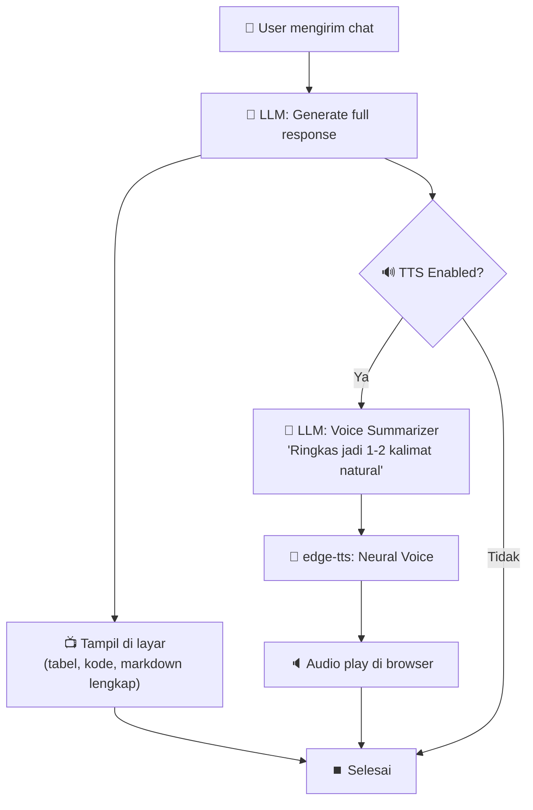

# 🎯 Implementation Plan: Jarvis-Style Intelligent Voice Assistant

> **Tujuan:** Mengubah sistem TTS dari "pembaca teks mentah" menjadi "asisten suara cerdas" yang merangkum respons secara natural, menyapa pengguna, dan terasa hidup seperti Jarvis.

---

## 📐 Arsitektur Dual-Output

Prinsip inti: **Layar untuk mata, suara untuk telinga.**



---

## 🗂️ Fase 1 — Voice Summary via LLM (Prioritas Utama)

Ini adalah perubahan inti yang paling berdampak. Setelah fase ini selesai, asisten sudah akan terasa seperti Jarvis.

### 1.1 Backend — Endpoint Voice Summary Baru

**File:** [web_ui.py](file:///E:/Hermes/app/hermes/web_ui.py)

| Item | Detail |
|---|---|
| Endpoint baru | `POST /api/tts/smart` |
| Input payload | `{ "text": "...", "voice": "...", "agent_name": "..." }` |
| Alur kerja | 1. Terima teks respons lengkap dari frontend → 2. Panggil LLM dengan prompt summarizer → 3. Hasilkan ringkasan lisan 1-3 kalimat → 4. Kirim ringkasan ke `edge-tts` → 5. Return audio MP3 |
| Fallback | Jika LLM gagal/timeout → fallback ke mode lama (baca 100 karakter pertama) |

**Prompt Voice Summarizer** (disisipkan sebagai system message):

```
Kamu adalah {agent_name}, asisten AI yang cerdas dan natural.

TUGASMU: Rangkum respons berikut menjadi kalimat lisan SINGKAT (maksimal 2 kalimat, 
maksimal 40 kata) yang akan diucapkan oleh text-to-speech.

ATURAN:
1. Bicara sebagai orang pertama ("Saya sudah...", "Ini hasilnya...", "Saya rekomendasikan...")
2. JANGAN sebut simbol markdown, tabel, atau format teknis
3. JANGAN ulangi seluruh isi — sampaikan INTI dan KESIMPULAN saja
4. Gunakan bahasa yang sama dengan respons asli (Indonesia/Inggris)
5. Jika respons berisi daftar/perbandingan → sebutkan rekomendasi utama saja
6. Jika respons berisi konfirmasi aksi → konfirmasi singkat apa yang sudah dilakukan
7. Jika respons berisi error → jelaskan masalah dan solusi singkat
8. Nada bicara: percaya diri, hangat, profesional — seperti asisten pribadi

CONTOH:
- Input: [tabel perbandingan 5 framework] → Output: "Saya sudah siapkan perbandingannya. Rekomendasi saya Next.js karena paling cocok untuk kebutuhan kamu."
- Input: [task berhasil di-queue] → Output: "Task sudah saya antrekan untuk project v3. Tinggal tekan Run kalau sudah siap."
- Input: [penjelasan error 3 paragraf] → Output: "Masalahnya ada di konfigurasi database. Solusinya sudah saya tulis di layar."
```

> [!IMPORTANT]
> Kita menggunakan model AI yang SAMA (DeepSeek/NVIDIA) yang sudah dikonfigurasi user. Tidak perlu API key tambahan.

### 1.2 Backend — Perubahan pada Endpoint TTS Lama

**File:** [web_ui.py](file:///E:/Hermes/app/hermes/web_ui.py)

| Item | Detail |
|---|---|
| Endpoint lama | `POST /api/tts` tetap dipertahankan sebagai fallback |
| Perubahan | Tidak ada — endpoint ini menjadi mode "legacy/verbatim" |

### 1.3 Frontend — Dashboard Smart TTS Flow

**File:** [Dashboard.tsx](file:///E:/Hermes/app/web/src/pages/Dashboard.tsx)

Perubahan pada fungsi `speakText`:

```
SEBELUM:
  speakText(fullResponseText)
    → POST /api/tts { text: fullResponseText }
    → Play audio (membaca semuanya)

SESUDAH:
  speakText(fullResponseText)
    → Cek mode di localStorage: "smart" atau "verbatim"
    → Jika "smart":
        POST /api/tts/smart { text: fullResponseText, voice, agent_name }
        → Play audio (ringkasan cerdas 1-2 kalimat)
    → Jika "verbatim":
        POST /api/tts { text: fullResponseText, voice }
        → Play audio (baca semua, mode lama)
```

### 1.4 Frontend — Pengaturan Mode Suara

**File:** [ConfigVoice.tsx](file:///E:/Hermes/app/web/src/pages/ConfigVoice.tsx)

Tambahkan opsi baru di tab Voice Output:

| Kontrol | Tipe | Default | Keterangan |
|---|---|---|---|
| Mode Suara | Radio/Select | `smart` | Pilihan: **Smart (Jarvis)** — ringkasan cerdas, atau **Verbatim** — baca semua |
| Panjang Maks | Slider | `40 kata` | Batas maksimal kata untuk ringkasan (hanya aktif di mode Smart) |

Semua nilai disimpan di `localStorage` dengan key:
- `hermes_tts_mode` → `"smart"` | `"verbatim"`
- `hermes_tts_max_words` → number

---

## 🗂️ Fase 2 — Proactive Greeting & Status Voice

Setelah Fase 1 selesai, kita lanjutkan dengan membuat asisten terasa "hidup" — dia menyapa saat sesi dimulai dan memberi tahu saat ada event penting.

### 2.1 Greeting Saat Sesi Baru Dibuka

**File:** [Dashboard.tsx](file:///E:/Hermes/app/web/src/pages/Dashboard.tsx)

| Trigger | Aksi |
|---|---|
| Sesi chat baru dibuka (kosong, belum ada pesan) | Panggil `POST /api/tts/smart` dengan teks kontekstual |
| Klik tombol `+ New` di sidebar | Sama seperti di atas |

**Teks greeting yang dikirim ke summarizer:**

```
Sapa pengguna dengan hangat. Perkenalkan diri sebagai {agent_name}. 
Tanyakan apa yang bisa dibantu hari ini. Maksimal 1 kalimat.
Waktu sekarang: {current_time} ({pagi/siang/sore/malam}).
```

Contoh output suara:
- *"Selamat siang! Ev siap membantu. Mau ngerjain apa hari ini?"*
- *"Hai! Ada yang bisa saya bantu malam ini?"*

### 2.2 Notifikasi Suara Saat Task Selesai (Opsional)

**File:** [Dashboard.tsx](file:///E:/Hermes/app/web/src/pages/Dashboard.tsx)

| Trigger | Aksi |
|---|---|
| Polling task status berubah jadi `done` atau `failed` | Panggil TTS smart dengan ringkasan hasil |

**Teks yang dikirim:**
```
Task "{task_description}" untuk project {project_name} sudah selesai 
dengan status: {success/failed}. Ringkas jadi 1 kalimat.
```

Contoh output suara:
- *"Task build untuk project v3 sudah selesai dengan sukses."*
- *"Ada masalah saat menjalankan testing project lite. Cek detailnya di layar."*

### 2.3 Pengaturan Tambahan di ConfigVoice

**File:** [ConfigVoice.tsx](file:///E:/Hermes/app/web/src/pages/ConfigVoice.tsx)

| Kontrol | Tipe | Default |
|---|---|---|
| Greeting saat sesi baru | Checkbox | ✅ Aktif |
| Notifikasi suara task selesai | Checkbox | ❌ Nonaktif |

---

## 🗂️ Fase 3 — Personality & Emotion (Polish)

Fase terakhir untuk menyempurnakan pengalaman.

### 3.1 Personality Presets

**File:** [ConfigVoice.tsx](file:///E:/Hermes/app/web/src/pages/ConfigVoice.tsx)

Tambahkan dropdown **"Gaya Bicara"** dengan preset:

| Preset | Deskripsi | Contoh |
|---|---|---|
| **Professional** | Formal, ringkas, to-the-point | *"Task telah berhasil dieksekusi. Hasilnya tersedia di layar."* |
| **Friendly** | Santai, hangat, supportive | *"Udah beres nih! Cek hasilnya di layar ya."* |
| **Jarvis Classic** | Formal British, elegan | *"The task has been completed successfully, sir."* |

Preset ini diterjemahkan menjadi instruksi tambahan di prompt voice summarizer.

### 3.2 Konteks Emosional Otomatis

Tambahkan deteksi otomatis di prompt summarizer:

```
KONTEKS EMOSIONAL (pilih otomatis berdasarkan isi):
- Jika respons berisi keberhasilan/konfirmasi → nada percaya diri dan positif
- Jika respons berisi error/warning → nada serius dan solutif  
- Jika respons berisi pertanyaan balik → nada sopan dan mengundang
- Jika respons berisi salam/greeting → nada hangat dan ramah
```

---

## 📁 Ringkasan Perubahan Per-File

### Fase 1 (Core)

| File | Perubahan |
|---|---|
| [web_ui.py](file:///E:/Hermes/app/hermes/web_ui.py) | + Endpoint `POST /api/tts/smart` dengan LLM voice summarizer |
| [Dashboard.tsx](file:///E:/Hermes/app/web/src/pages/Dashboard.tsx) | Ubah `speakText` → panggil `/api/tts/smart` jika mode = smart |
| [ConfigVoice.tsx](file:///E:/Hermes/app/web/src/pages/ConfigVoice.tsx) | + Radio pilihan mode (Smart / Verbatim), + Slider max words |

### Fase 2 (Proactive)

| File | Perubahan |
|---|---|
| [Dashboard.tsx](file:///E:/Hermes/app/web/src/pages/Dashboard.tsx) | + Greeting suara saat sesi baru, + Notifikasi suara task selesai |
| [ConfigVoice.tsx](file:///E:/Hermes/app/web/src/pages/ConfigVoice.tsx) | + Checkbox greeting & notifikasi task |

### Fase 3 (Polish)

| File | Perubahan |
|---|---|
| [ConfigVoice.tsx](file:///E:/Hermes/app/web/src/pages/ConfigVoice.tsx) | + Dropdown personality preset |
| [web_ui.py](file:///E:/Hermes/app/hermes/web_ui.py) | + Parameter personality di prompt summarizer |

---

## ⏱️ Estimasi Dampak

| Metrik | Sebelum | Sesudah (Fase 1) |
|---|---|---|
| Durasi suara per respons | 30-120 detik | 5-15 detik |
| Naturalness | Membaca dokumen | Percakapan asisten pribadi |
| Latensi tambahan | 0 | +1-3 detik (LLM summarize) |
| Biaya API tambahan | 0 | ~50-100 token per respons |
| File yang diubah | - | 3 file |

---

> [!NOTE]
> Plan ini dirancang **backwards-compatible** — mode Verbatim (lama) tetap tersedia sebagai pilihan di pengaturan. User yang tidak ingin ringkasan tetap bisa menggunakan mode baca-semua seperti sebelumnya.

> [!TIP]
> Fase 1 saja sudah cukup untuk mengubah pengalaman secara drastis. Fase 2 dan 3 adalah enhancement yang bisa dikerjakan bertahap setelah Fase 1 stabil.
